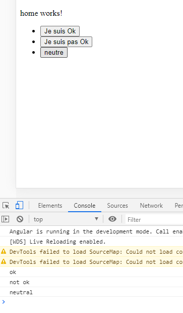

# Les clicks, output et event emitter

* [Créer un click](#créer-un-click)
* [Event emitter](#event-emitter)
* [Behavior subject](#behavior-subject)

## Créer un click

* On commence par créer un nouveau module, par exemple mood, (`ng g m components/mood`) ainsi qu'un component (`ng g c components/mood`).

* Dans le fichier mood.module.ts, il faut exporter le moodComponent afin qu'l soit accessible de l'extérieur :

```
import { NgModule } from '@angular/core';
import { CommonModule } from '@angular/common';
import { MoodComponent } from './mood.component';


@NgModule({
    declarations: [MoodComponent],

// EXPORT DU MOODCOMPONENT=============================

    exports: [
        MoodComponent,
    ],


    imports: [
        CommonModule
    ]
})
export class MoodModule { }
```

* On veut désormais importer le moodComponent dans le component principal de l'app. Pour ce faire, on va dans le fichier
html de l'app, on entre la balise <app-mood> cela nous propose automatiquement de l'importer, on fait ok, le moodComponent
est bien importer dans le module de l'app :

```
// DANS LE HTML DE L'APP=============================

<h1>Mon app</h1>
<app-menu1 [age]="age" ></app-menu1>
<router-outlet></router-outlet>

<app-mood></app-mood>

// IMPORT AUTOMATIQUE DANS LE MODULE DE L'APP=============================

import { BrowserModule } from '@angular/platform-browser';
import { NgModule } from '@angular/core';

import { AppRoutingModule } from './app-routing.module';
import { AppComponent } from './app.component';
import {MainMenuModule} from "./components/main-menu/main-menu.module";
==============================================================
import {MoodModule} from "./components/mood/mood.module";
==============================================================

@NgModule({
  declarations: [
    AppComponent
  ],
    imports: [
        BrowserModule,
        AppRoutingModule,
        MainMenuModule,
==============================================================
        MoodModule,
==============================================================
    ],
  providers: [],
  bootstrap: [AppComponent]
})
export class AppModule { }
```

* Dans le html de notre component mood, on va ajouter 3 boutons qui vont envoyer des informations. Dans notre exemple, on veut
connaître l'humeur de l'utilisateur, on va donc commencer par créer 3 fonctions afin de savoir si l'utilisateur va bien, pas bien ou est
d'humeur neutre, on crée donc ses fonctions dans le component du module mood :

```
import { Component, OnInit } from '@angular/core';

@Component({
  selector: 'app-mood',
  templateUrl: './mood.component.html',
  styleUrls: ['./mood.component.scss']
})
export class MoodComponent implements OnInit {

  constructor() { }

  ngOnInit(): void {
  }

// NOS 3 FONCTIONS=============================

  iAmOk() {
    console.log('ok');
  }
  iAmNotOk() {
    console.log('not ok');
  }
  neutral() {
    console.log('neutral');
  }
}
```

* On crée alors nos 3 boutons en html :

```html
<div>
  <ul>
    <li><button (click)="iAmOk()">Je suis Ok</button></li>
    <li><button (click)="iAmNotOk()">Je suis pas Ok</button></li>
    <li><button (click)="neutral()">neutre</button></li>
  </ul>
</div>
```

* On obtient bien 3 boutons, dont on peut récupérer les interactions utilisateur :



## Event emitter

Avec Angular, on peut faire remonter une information d'un component enfant à son parent. Cela sert à dire au parent, qu'il
s'est passé quelque chose dans le component enfant.

* Pour remonter une information au parent, on va émettre une information grâce à ce que l'on appelle un event emitter dans
le component du module mood, que l'on va appeler handleMoodChange. C'est un décorateur de type output, qui est de type
EventEmitter\<string> :

```
import {Component, EventEmitter, OnInit, Output} from '@angular/core';

@Component({
  selector: 'app-mood',
  templateUrl: './mood.component.html',
  styleUrls: ['./mood.component.scss']
})
export class MoodComponent implements OnInit {

// CREATION DE NOTRE DECORATEUR DE TYPE OUTPUT=============================

  @Output() handleMoodChange: EventEmitter<string> = new EventEmitter<string>();

==============================================================

  constructor() { }

  ngOnInit(): void {
  }

  iAmOk() {
    console.log('ok');
  }
  iAmNotOk() {
    console.log('not ok');
  }
  neutral() {
    console.log('neutral');
  }
}
```

* On va donc pouvoir désormais envoyer des informations au parent, on peut donc changer nos fonctions :

```
import {Component, EventEmitter, OnInit, Output} from '@angular/core';

@Component({
  selector: 'app-mood',
  templateUrl: './mood.component.html',
  styleUrls: ['./mood.component.scss']
})
export class MoodComponent implements OnInit {

  @Output() handleMoodChange: EventEmitter<string> = new EventEmitter<string>();

  constructor() { }

  ngOnInit(): void {
  }

// ENVOI DES CHANGEMENTS DE L'ENFANT AU PARENT=============================

  iAmOk() {
    this.handleMoodChange.emit('ok');
  }
  iAmNotOk() {
    this.handleMoodChange.emit(' not ok');
  }
  neutral() {
    this.handleMoodChange.emit('neutral');
  }

==============================================================

}
```

* Dans le component parent (app.component.ts) on va maintenant réer une fonction afin de recevoir et manager les informations
des changements de l'enfant reçues. Cette fonction va prendre en paramètre le message reçu :

```
export class AppComponent {
  title = 'promo4Angular';

// DEFINITION DU MESSAGE=============================
    message: string;
==============================================================

  allRoutes: MenuModel[] = this.menuService.allRoutes;

  age = 42;

  constructor(
    private menuService: MenuService
  ) {
  }

// CREATION DE LA FONCTION DE RECEPTION DU MESSAGE DE L'ENFANT=============================
  manageMoodChange(message: string) {
    this.message = message;
  }
==============================================================
}
```

* On peut désormais dans le html du component principal récupérer le message et passer la fonction crée manageMoodChange avec
comme paramètre l'event dan la fonction handleMoodChange :

```
// AFFICHAGE DU MESSAGE=============================
<h1>{{message}}</h1>
==============================================================

<app-menu1 [age]="age" ></app-menu1>
<router-outlet></router-outlet>

// A CHAQUE EMIT HANDLEMOODCHANGE EST TRIGGER ET VA CHERCHER MANAGEMOODCHANGE=============================
<app-mood (handleMoodChange)="manageMoodChange($event)"></app-mood>
==============================================================
```

On récupère bien le message dans le parent à chaque emit d'une information de l'enfant :


## Behavior subject

Dans le cas où l'on veut récupérer un event emitter mais qu'il n'y a pas de relation enfant/parent, il faut utiliser un service
grâce à un behavior subject.

* On commence par créer un nouveau service (dans notre cas un service mood) `ng g s services/mood`

* On va créer alors un event emitter dans le service. Cependant dans un service, cela s'appelle un behavior subject. On
le crée dans le fichier mood.service.ts, en ajoutant un dollar à la fin :

```
export class MoodService {

  handleMood$: BehaviorSubject<string> = new BehaviorSubject<string>(null);

  constructor(
  ) { }
}
```

> À noter : un BehaviorSubject doit toujours être initialisé, on passe en paramètre 'null'

* On crée alors une deuxième fonction setMood qui prend en paramètre un message et qui va permettre de setter l'emit :

```
export class MoodService {

  handleMood$: BehaviorSubject<string> = new BehaviorSubject<string>(null);

  constructor(
  ) { }

  setMood(message: string) {
    this.handleMood$.next(message);
  }
}
```

> À noter : next signifie que cela va prendre en compte la prochaine value que va prendre mood

* On va alors injecter dans le component mood le moodService :

```
export class MoodComponent implements OnInit {

  constructor(
    private moodService: MoodService,
  ) {
  }
```

* Puis on corrige nos 3 fonctions de façon à ce qu'elles récupèrent le message :

```
export class MoodComponent implements OnInit {

  constructor(
    private moodService: MoodService,
  ) {
  }

  ngOnInit(): void {
  }

  iAmOk() {
    this.moodService.setMood('Je suis Ok');
  }

  iAmNotOk() {
    this.moodService.setMood('Je ne suis pas Ok');
  }

  neutral() {
    this.moodService.setMood('Je suis neutre');
  }
}
```

* Enfin, dans l'AppComponent on va implémenter OnInit et souscrire au moodService :

```
export class AppComponent implements OnInit{
  title = 'promo4Angular';

  message: string;

  allRoutes: MenuModel[] = this.menuService.allRoutes;

  age = 42;

  constructor(
    private menuService: MenuService,
    private moodService: MoodService,
  ) {
  }

  ngOnInit(): void {
    this.moodService.handleMood$
      .pipe(
        tap((message: string) => this.message = message)
      )
      .subscribe();
  }
}
```

* On obtient bien nos interactions entre components complétements éloignés les uns des autres :


