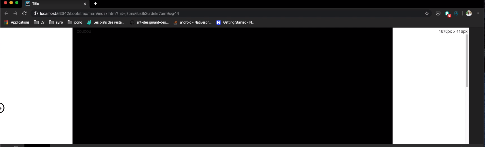
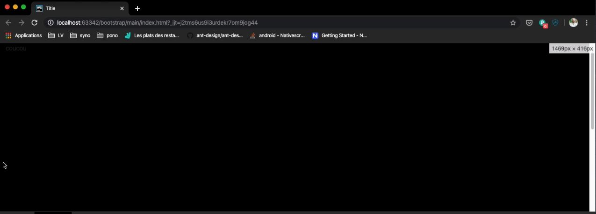
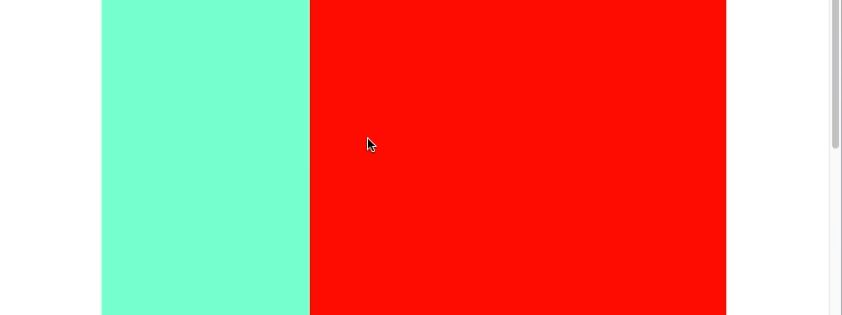
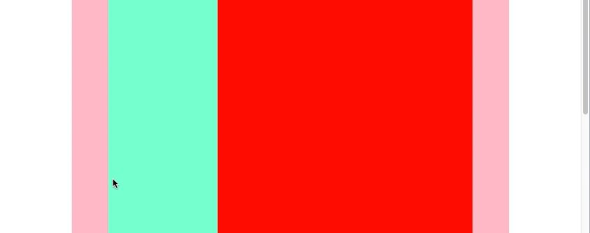
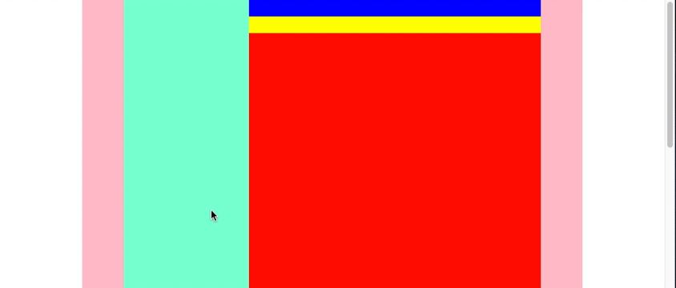
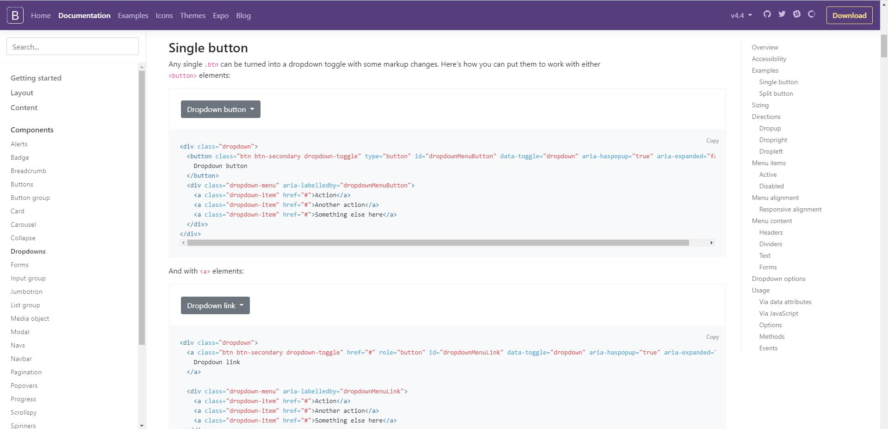

# Bootstrap

* [Qu'est-ce que Bootstrap?](#quest-ce-que-bootstrap)
* [Lier Bootstrap à son fichier html](#lier-bootstrap-à-son-fichier-html)
* [Les containers](#les-containers)
    * [La class container](#la-class-container)
    * [La class container-fluid](#la-class-container-fluid)
* [Les row et col](#les-row-et-col)
* [Intégrer des components bootstrap](#intégrer-des-components-bootstrap)
* [Modifier bootstrap](#modifier-bootstrap)

## Qu'est-ce que Bootstrap?

Bootstrap est un framework de mise en page (CSS), c'est un "cadre de travail" qui permet de structurer sa façon de travailler

## Installation

* Pour l'IDE Webstorm, il faut préalablement installer [node.js](https://nodejs.org/en/) _(Télécharer la dernière versio "current")_
* Ouvrir le terminal de Webstorm
* taper: npm init + enter plusieurs fois (cela crée un fichier package.json qui permet d'installer des logiciels)
* taper: npm install bootstrap + enter
* Bootstrap est installer

## Lier Bootstrap à son fichier html

* Dans le dossier main on crée un fichier html nommé index
* On fait un lien avec la balise Link tel que ci-dessous:

\<link rel="stylesheet" href="../node_modules/bootstrap/dist/css/bootstrap.css">

* On peut désormais utiliser Bootstrap et ces styles prédéfinis, ex: **class="container"**

* Attention: Le contenu bootstrap est subdivisé en 12 colonnes
* Il faut donc lorsqu'on utilise des rows et des colonnes on peyt utiliser des subdivisions ex: col-4 pour la 1ère
colonne et col-8 pour la 2éme, pour centré on peut réduire d'un par exemple et ajouté des offset-1

## Les containers:

* Il y a 2 types de class container bootstrap:
    * container
    * container-fluid
    
#### La class container

* La class container est utilisé pour les sites internet centrés (cf image ci-dessous):

    

#### La class container-fluid

* La class container-fluid est utilisé pour les sites internet pleine page (cf image ci-dessous):

    


## Les row et col:

> **Il est totalement interdit d'avoir de row sans col !**
>
>Les class bootstrap row et col remplacent les éléments html \<tr> (row) et\<td> ou \<th> (col)

* Les col prennent toute la place disponible

* **Dans bootstrap le container est divisé en 12 col !**

* Si on désire créer une col qui a une largeur prédéfinie il faut utiliser les class col-x (x étant un nombre entre 1 et 12)

    * Par exemple: pour un container (qu'on a mis en rose):
    
    
     
    * si l'on veut avoir une colonne bleue d'1/3 et une colonne rouge de 2/3, on écrit:
    

  ```html
    <div class="row">
          <div class="col-4 colorBlue"></div>
          <div class="col-8" colorRed></div>
    </div>
   ```


* Si l'on souhaite garder des marges, il faut utiliser les class offset-x (1 <= x <= 12)

* **Attention il ne faut jamais que le total des col-x et des offset-x dépasse 12, le nombre de col totale de bootstrap!**

    * Par exemple dans notre exemple précédent si on veux garder une marge à gauche et à droite, on écrit:
    
  ```html
    <div class="row">
          <div class="col-3 offset-1 colorBlue"></div>
          <div class="col-7" colorRed></div>
    </div>
   ```


* On peut ajouter d'autres row et col dans une col

    * Par exemple:
    
```html
   <div class="row">
        <div class="col-3 offset-1 colorBlue"></div>

        <div class="col-7" colorRed>

            <div class="row color-darkBlue">
                <div class="col">&nbsp;</div>
            </div>
            
            <div class="row Yellow">
                <div class="col">&nbsp;</div>
                <div class="col">&nbsp;</div>
            </div>

        </div>
    </div>
```


> Astuce: Il faut toujours mettre du contenu pour que les row s'affichent (Pas besoin pour les col), si on veut tester ses row et col sans contenu on utilise le Non-breaking Space: \&nbsp;

## Intégrer des components bootstrap:

* Aller sur le site bootstrap pour trouver les components [bootstrap](https://getbootstrap.com/docs/4.4/components/alerts/)
* Bien penser à faire le lien bootstrap (et css) dans son header
* Installer jquery:
    
    `npm install jquery`
    
* Il faut aussi insérer un lien vers jquery (avant bootstrap car bootstrap a besoi de jquery pour marcher):

    `<script src="../jquery/dist/js/jquery.min"></script>`

* Il faut aussi insérer un lien vers js:

    `<script src="../node_modules/bootstrap/dist/js/bootstrap.bundle.min.js"></script>`

* Choisir un component (dans la page internet [bootstrap](https://getbootstrap.com/docs/4.4/components/alerts/)) et copier coller le code dans sa page html

    

## Modifier bootstrap:

   * **Ne jamais modifier un fichier vendors !!!** (exemple ne pas toucher au fichier bootstrap.css)

* Créer un fichier css dans le dossier css exemple: bootstrap-mod.css
* Faire ses modifications **dedans** par exemple pour modifier une class container créer une class my-container
* Ne pas oublier de faire le link dans la page html et le mettre **après** le link bootstrap (le css est en cascade la dernière feuille de style écrase celle d'avant)
* On peut aussi créer de nouvelles class exemple pour un button si on veut changer la couleur on peut créer une class buttonRed
