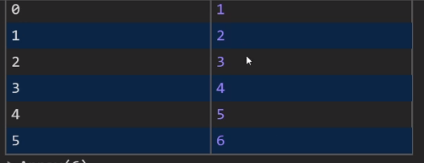
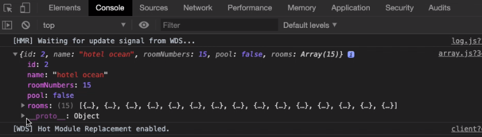
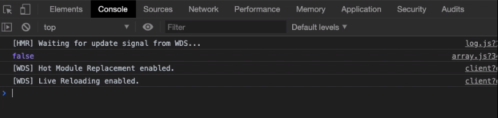
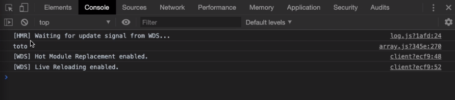

# Les array

* [Utiliser les tableaux (array)](#utiliser-les-tableaux-array)
* [les index des array](#les-index-des-array)
* [Les opérateurs](#les-opérateurs)
    * [forEach](#foreach)
    * [map](#map)
    * [filter](#filter)
    * [sort](#sort)
    * [push](#push)
    * [concat](#concat)
    * [splice](#splice)
    * [slice](#slice)
    * [reduce](#reduce)
    * [find](#find)
    * [every](#every)
    * [some](#some)
    * [toUpperCase](#touppercase)
    * [replace](#replace)
* [Array destructuration](#array-destructuration)

## Utiliser les tableaux (array)

Pour créer un tableau, écrire:

```javascript
const tab = [];
```

> Sur mac les crochets n'apparraissent pas sur le clavier, il faut faire Shift + Alt + 5

* ajouter ses objets (les const ou let prédéfinis), par exemple:

```javascript
const me = {
    firstName: 'Olivier',
    lastName: 'Portal',
    age: 39,
};

const user1 = {
    firstName: 'Joe',
    lastName: 'Lachance',
    age: 49,
};

const user2 = {
    firstName: 'Bobbye',
    lastName: 'La Teigne',
    age: 23,
};

const tab = [me, user1, user2];

console.log(tab);
console.table(tab);
```

## les index des array

* **Le premier élément des tableaux à l'index 0**

Pour obtenir le premier élément d'un tableau, on écrit:

```javascript
console.log(tab[0]);
```

Le deuxième:

```javascript
console.log(tab[1]);
```

etc.

* Si l'on veut savoir combien d'éléments existent dans un tableau, on écrit:

```javascript
console.log(tab.length);
```

* Pour obtenir le dernier élément du tableau:

```javascript
console.log(tab[tab.length - 1]);
```

> Car le tableau commence à 0, donc si on a 6 éléments dans le tableau, le premmier = 0, et le dernier = 5, il faut donc enlever 1 à la longueur du tableau !

## Les opérateurs

> Les opérateurs sont des fonctions

#### forEach

> L'opérateur forEach parcours tous les éléments d'un tableau

* Le premier opérateur (le plus simple) s'appelle forEach, cela signifie que l'on va parcourir tous les éléments du tableau

```javascript
tab.forEach();
```

* On écrit une fonction de call back, par exemple pour voir les utilisateurs: user => 

```javascript
tab.forEach(user => console.log(user));
```

* Afin de visualiser le résultat de manière plus compréhensible, ne pas hésiter à rajouter des string qui permettent une meilleure lecture du résultat:

```javascript
tab.forEach(user => console.log('user: ' user));
```
> On obtient alors le résultat (pour notre exemple):


* Pour écrire plus proprement son code, séparer la fonction de son argument par des {}:

```javascript
tab.forEach(user => {
    console.log('user: ' user)
});
```
* On peut obtenir un second argument comme l'index:

```javascript
tab.forEach((user, index) => {
    console.log('user: ' , index,  user)
});
```

> On obtient alors le résultat (pour notre exemple):


* Afin d'éviter d'échaper des caratères dans les string, on peut remplacer les simple quote '' par des backtick ``, cela s'appelle un **template de string**

```javascript
tab.forEach((user, index) => {
    console.log(`L'user dont l'index est: ` , index,  user)
});
```

* On peut aussi ajouter une variable à l'intérieur du template de string en écrivant ${}:

```javascript
tab.forEach((user, index) => {
    console.log(`L'user dont l'index est: ${index} s'appelle : ${user.firstName}`)
});
```

> On obtient alors le résultat (pour notre exemple):


#### map

> L'opérateur map fonctionne comme l'opérateur forEach, mais il renvoie une valeur

* On peut donc écrire:

```javascript
const tab2 = tab.map((user, index) => {
 return index;
});

console.table(tab2);
```
On obtient un nouveau tableau avec en valuer les index:


* Le tableau tab lui reste inchangé

* **Attention ! javascript est un language de passage par référence, ce qui signifie que lorsque l'on modifie un objet, on le modifie en mémoire**

* Afin d'éviter les erreurs on doit créer une nouvelle variable et on vient y stocker l'objet que l'on souhaite modifier:

```javascript
const tab2 = tab.map((user, index) => {
const temp = {...user};
temp.index = index;
return temp;
});

console.table(tab);
console.table(tab2);
``` 

On obtient bien 2 tableaux différents sans avoir modifié l'objet user:

* tab =


* tab2 =


#### filter

> Cet opérateur sert à filtrer les tableaux par exemple ne garder que des user qui on un age > 30ans

```javascript
const filteredArray = tab
    .filter(user => user.age > 30);

console.table(filteredArray);
``` 

* On obtient:


* On peut combiner les opérateurs :

```javascript
const filteredArray = tab
    .filter(isUnder30);
    .map(addSAtEnd);

function isUnder30(user) {
    return user.age < 30;
}

function addSAtEnd(user) {
    user.lastName = user.lastName + 's';
    return user;
}

console.table(filteredArray);
``` 

* On obtient:


> Cela s'appelle la programmation fonctionnelle


#### sort

> L'opérateur sort permet de réorganiser un tableau, par exemple mettre les user.age par ordre croissant

* **L'opérateur sort** ne prend pas une call back function mais **une compare function => cela renvoie un nombre, si le nombre est négatif, le premier objet passe devant, si le nombre est positif le 2ème objet passe devant** ; On remet en ordre les objets, l'opération continue sur tous les objets

* On écrit:

```javascript
const sortedArray = tab.sort((user1, user2) => user1.age - user2.age);

console.table(sortedArray);
``` 

* On obtient:


* En inversant user1 et user2, on obtient un classement par ordre décroissant

* Attention ! Par ordre alphabétique, c'est plus compliqué car ce sont des string:

* Il faut rajouter des conditions if & else:

```javascript
const sortedArray = tab.sort((user1, user2) => {
    if (user1.firstName < user2.firstName) {
        return -1;   
} else {
        return +1;
        }
});

console.table(sortedArray);
``` 

* On obtient:


* On peut écrire la même chose en plus court grâce au ternaire

* Un ternaire c'est:

    * Un prédicat (ce qui renvoi un boolean) `return user1.firstName < user2.firstName ? -1 : +1` **Il faut ajouter un ? pour dire que c'est un prédicat

*  On écrit alors:

```javascript
const sortedArray = tab
.sort((user1, user2) => user1.firstName < user2.firstName ? -1 : +1);   

console.table(sortedArray);
``` 

* On obtient le même résultat mais en écrivant une seule ligne de code

#### push

> L'opérateur push ajoute une valeur dans un tableau

* L'opérateur push ajoute la valeur au dernier index

* On écrit:

```javascript
const tab = [];

const baby1 = {
     name: 'basile'
};

const baby2 = {
    name: 'babyboutchou'
};

tab.push(baby1, baby2);

console.table(tab);
``` 

* On obtient:


#### concat

> L'opérateur concat fabrique un nouveau tableau un ajoutant les valeurs de 2 tableaux

* On écrit:

```javascript
tab1 = [1, 2, 3];

tab2 = [4, 5, 6];

const tab3 = tab1.concat(tab2);

console.table(tab3);
``` 

* On obtient:



* **On peut très bien se passer de l'opérateur concat en écrivant:**

```javascript
tab1 = [1, 2, 3];

tab2 = [4, 5, 6];

const tab3 = [...tab1, ...tab2]

console.table(tab3);
``` 

* On obtient le même résultat

#### splice

> L'opérateur splice permet d'insérer ou de supprimer des valeurs

* On écrit:

```javascript
tab1 = [1, 2, 3, 4, 5, 7];

tab1.splice(5, 0, 6);

// Le premier chiffre correspond à la position de départ (start)
// Le 2ème indique le nombre de valeurs que l'on souhaite enlever
// Le 3ème indique la valeur que l'on veut rajouter

console.log(tab1);
``` 

* On obtient:


* Pour enlever des valeurs, on écrit:

```javascript
tab1 = [1, 2, 3, 4, 5, 7];

tab1.splice(5, 1);

console.log(tab1);
``` 

* On obtient:


#### slice

> L'opérateur slice extrait des valeurs et crée un nouvel objet avec les valeurs extraites

```javascript
tab1 = [1, 2, 3, 4, 5, 6];

const tab2 = tab1.slice(1,4);

console.table(tab2);
``` 
* On obtient:


#### reduce

> L'opérateur reduce applique une fonction qui est un « accumulateur » et qui traite chaque valeur d'une liste (de la gauche vers la droite) afin de la réduire à une seule valeur

* On peut utiliser l'opérateur reduce avec des tableaux, des string, des nombres...

* **Attention ! Toujours renseigner le type de résultat voulu dans un reduce !**

* Exemple d'utilisation avec des nombres:

```javascript
const tabNumber = [2, 5, 10, 2, 33];

const total = tabNumber
    .reduce((acc, currentValue) => acc = acc + currentValue, 0)

console.log(total);
``` 

* On obtient:


> N'utiliser reduce que pour faire des accumulations !

* Exemple d'utilisation avec des string:

```javascript
const tabNumber = ['a', 'b', 'c', 'd'];

const total = tabNumber
    .reduce((acc, currentValue) => acc = acc + currentValue, '')

console.log(total);
``` 

* On obtient:


* Exemple d'utilisation avec des objets, si l'on veut calculer la moyenne d'âge des utilisateurs:

```javascript
const tabNumber = [
    {firstName: 'toto', age: 12};
    {firstName: 'tata', age: 13};
    {firstName: 'titi', age: 14};
    {firstName: 'tutu', age: 15};
];

const total = tabNumber
    .reduce((acc, currentValue) => acc + currentValue.age, 0)

console.log(total / 4);
``` 

* On obtient:


* Exemple d'utilisation avec des objets, si l'on veut concaténer des array:

```javascript
const tabNumber = [
    {firstName: 'toto', age: 12, hobbies: ['foot', 'playstation']};
    {firstName: 'tata', age: 13, hobbies: ['foot', 'playstation']};
    {firstName: 'titi', age: 14, hobbies: ['foot', 'playstation']};
    {firstName: 'tutu', age: 15, hobbies: ['foot', 'playstation']};
];

const total = tabNumber
    .reduce((acc, currentValue) => acc.concat(currentValue.hobbies), [])

console.log(total);
``` 

* On obtient:


#### find

> L'opérateur find renvoie la valeur du premier élément trouvé dans le tableau qui respecte la condition donnée par la fonction de test passée en argument. Sinon, la valeur undefined est renvoyée

* L'opérateur find utilise des prédicat et donc renvoie un booléen

* Exemple dans un tableau avec plusieurs hôtels, si l'on veut retrouver l'hôtel qui s'appelle 'hotel ocean'
on écrit:

```javascript
const hotelToFind = hotels.find(hotel => hotel.name === 'hotel ocean');

console.log(hotelToFind);
``` 

* On obtient:



* **Attention ! L'opérateur find ne renvoie que la première valeur qu'il a trouvé**

* **Attention ! On ne peut pas chaîner les opérateurs après un find, car il ne renvoie pas un array mais un boolean**

#### every

> L'opérateur every renvoie un booléen, il renvoie true si tous les éléments d'un tableau répondent à un prédicat

* Exemple dans un tableau avec plusieurs hôtels, si l'on veut savoir si **tous** les hôtels ont une piscine, on écrit:

```javascript
const allHostelsHavePools = hostels.every(hotel => hotel.pool === true);

console.log(allHostelsHavePools);
``` 

* On obtient:



* Dans ce cas si, la valeur est false car dans le tableau des hôtels **tous** les hôtels n'ont pas de piscine (hotel 2):


#### some

> L'opérateur some renvoie aussi un booléen, il renvoie true si **au moins un seul** des éléments d'un tableau répondent à un prédicat

* Exemple dans un tableau avec plusieurs hôtels, si l'on veut savoir si **au moins un seul** des hôtels a une piscine, on écrit:

```javascript
const allHostelsHavePools = hostels.some(hotel => hotel.pool === false);

console.log(allHostelsHavePools);
``` 
* Si dans notre tableau on met des piscines à tous les hôtels


* On obtient:


#### toUpperCase

> L'opérateur touppercase permet de mettre en majuscule des mots, des phrases ou la première lettre d'un mot

* Attention il est plus simple de mettre en **MAJUSCULE grâce au CSS** qu'en js!!!


```javascript
const sentence = 'The quick brown fox jumps over the lazy dog.';

console.log(sentence.toUpperCase());

// output: "THE QUICK BROWN FOX JUMPS OVER THE LAZY DOG."
``` 
* Pour mettre en majusucle la première lettre d'un mot on utilise les opérateurs charAt(0) (cela sélectionne la lettre à l'indice indiqué)
et slice(1) pour supprimer la minuscule que l'on remplace

```javascript
const name = 'flavio'

const nameCapitalized = name.charAt(0).toUpperCase() + name.slice(1)

// expected output: "Flavio"
``` 

#### replace

> L'opérateur replace permet de changer une lettre ou un mot par un(e) autre

* L'opérateur replace envoie une nouvelle chaîne de caractères dans laquelle tout ou partie des correspondances à un modèle sont remplacées

```javascript
const p = 'The quick brown fox jumps over the lazy dog. If the dog reacted, was it really lazy?';

const regex = /dog/gi;

console.log(p.replace(regex, 'ferret'));
// expected output: "The quick brown fox jumps over the lazy ferret. If the ferret reacted, was it really lazy?"

console.log(p.replace('dog', 'monkey'));
// expected output: "The quick brown fox jumps over the lazy monkey. If the dog reacted, was it really lazy?"
``` 

* Pour remplacer une lettre ou un mot dans un texte à toutes ses occurrences on utilise **/g pour global**

```javascript
const myStr = 'this,is,a,test';

const newStr = myStr.replace(/,/g, '-');

console.log( newStr );  // "this-is-a-test"
``` 

## Array destructuration

> La destructuration permet de récupérer les variables dans un tableau afin de leur donner un nom directement et donc d'y accéder
> plus facilement

* Pour créer un tableau déstructuré, on crée une variable d'un tableau vide qu'on assigne à un autre tableau:

```javascript
tab = ['tata', 'titi', 'toto', 'tutu'];

const [] = tab;

console.log(tab);
``` 

> Cela crée un tableau destructuré qui n'a pour l'instant aucune valeur en relation avec le tableau initial

* Pour mettre en relation les valeurs, on écrit:

```javascript
tab = ['tata', 'titi', 'toto', 'tutu'];

const [var1, var2, var3, var4] = tab;

console.log(var3);
``` 

* Ce qui donne:



> Astuce: On n'est pas obligé de mettre en relation toutes les valeurs, on peut écrire:
> ```javascript
> tab = ['tata', 'titi', 'toto', 'tutu'];
> 
> const [,, var3,] = tab;
> 
> console.log(var3);
> ``` 
> 
>Le résultat sera le même si l'on console.log var3
