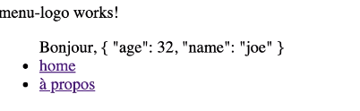

# Interpolations

* [Créer une interpolation html](#créer-une-interpolation-html)
* [Les pipes](#les-pipes)
* [Interpolation d'une propriété](#interpolation-dune-proprit)

## Créer une interpolation html

Avec Angular pour créer une interpolation dans le html, il faut mettre la variable entre 2 doubles crochets :

```
<ul>
  Bonjour, {{name}}
</ul>
```

On définit notre attribut dans le fichier MonComponents.component.ts à l'intérieur de la class :

```
export class Menu1Component implements OnInit {

  name: string;

  constructor() {
  }

  ngOnInit(): void {
    this.name = 'Olivier'
  }
}
```

> À noter : ngOnInit est l'initialisation du component (ce qui est égal à un return)

## Les pipes

Les interpolations avec Angular ne savent ni lire du code 'logique' (on ne peut pas mettre de if ou autre), ni lire un objet.

Par contre, pour les objets on peut utiliser un pipe qui va nous permettre de lire les valeurs des objets dans les interpolations
html.

Si, par exemple on a une fonction user définie dans le component qui retourne un objet 'user' avec des keys 'age' et 'name' :

```
export class Menu1Component implements OnInit {

  name: string;
  age = 12;

  constructor() {
  }

  ngOnInit(): void {
  }

  user() {
    return {age: 32, name: 'Joe'}
  }

}
```

On peut retourner leurs valeurs dans le html grâce au pipe :

```
<ul>
  Bonjour, {{user() | json }}
</ul>
```



## Interpolation d'une propriété

Pour interpoler une propriété, il suffit de mettre le paramètre entre crochets. Par exemple, pour une URL définie dans la
class par link1 :

```
export class Menu1Component implements OnInit {

  name: string;
  age = 12;

   link1 = 'home';

  constructor() {
  }

  ngOnInit(): void {
  }

  user() {
    return {age: 32, name: 'Joe'}
  }

}
```

Il suffit dans le html de mettre le paramètre RouterLink entre crochets :

```
<app-menu-logo></app-menu-logo>
<ul>
  Bonjour, {{user().name}}

    <li *ngIf="age> current.minimumAge">
      <a [routerLink]="link1">home</a>
    </li>
</ul>
```
