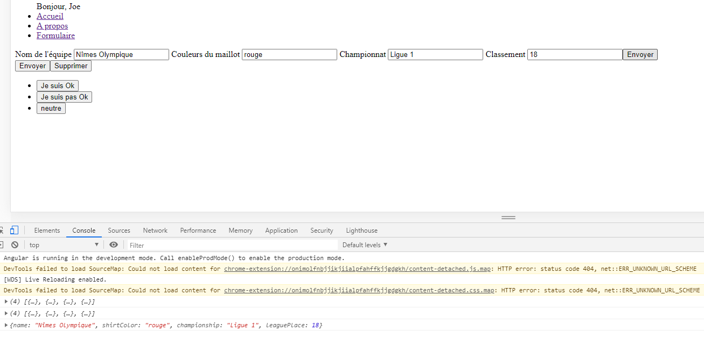
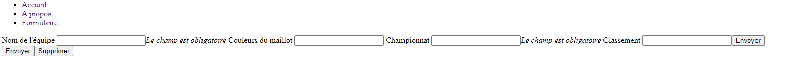

# Form

* [Les formulaires](#les-formulaires)
* [Validators](#validators)

## Les formulaires

* Pour créer un formulaire il faut créer un module de type page `ng g m form --route=form --module=app-routing`

* On a besoin du gestionnaire de formulaire d'angular, que l'on ajoute dans le module de l'app du formulaire. Le gestionnaire
de formulaire s'appelle **ReactiveFormsModule**

* Ensuite on doit activer le FormBuilder qui est un outil fourni par Angular pour nous aider à créer des formulaires. On l'active
dans le component de l'app. Par convention on le nommera fb :

```angular2html
import { Component, OnInit } from '@angular/core';
import {FormBuilder} from "@angular/forms";

@Component({
  selector: 'app-form',
  templateUrl: './form.component.html',
  styleUrls: ['./form.component.scss']
})
export class FormComponent implements OnInit {
========================================================
  constructor(
    private fb: FormBuilder
  ) { }
========================================================
  ngOnInit(): void {
  }

}
```

* On va alors déclarer que l'on a un formulaire de type FormGroup :

```angular2html
import { Component, OnInit } from '@angular/core';
import {FormBuilder, FormGroup} from "@angular/forms";

@Component({
  selector: 'app-form',
  templateUrl: './form.component.html',
  styleUrls: ['./form.component.scss']
})
export class FormComponent implements OnInit {
========================================================
  myForm: FormGroup;
========================================================
  constructor(
    private fb: FormBuilder
  ) { }

  ngOnInit(): void {
========================================================
    this.myForm = this.fb.group({
      name: [null, []],
      shirtColor: [null, []],
      championship: [null, []],
      leaguePlace: [null, []],
========================================================
    })
  }

}
```

* On crée alors le formulaire dans le html, en ajoutant le [formGroup] dans la balise form et dans chaque input le formControlName:

```html
<form [formGroup]="myForm">
  <label>
    Nom de l'équipe
    <input type="text" formControlName="name">
  </label>
  <label>
    Couleurs du maillot
    <input type="text" formControlName="shirtColor">
  </label>
  <label>
    Championnat
    <input type="text" formControlName="championship">
  </label>
  <label>
    Classement
    <input type="number" formControlName="leaguePlace">
  </label>
</form>
```

* Il faut ensuite créer un bouton d'envoi du formulaire, on commence par créer une fonction qui exécutera l'envoi des données
 dans le component de l'App :

```
  sendForm() {
    console.log(this.myForm.value);
  }
```

* Puis on ajoute la fonction au formulaire html :

```html
========================================================
<form [formGroup]="myForm" (ngSubmit)="sendForm()">
========================================================
  <label>
    Nom de l'équipe
    <input type="text" formControlName="name">
  </label>
  <label>
    Couleurs du maillot
    <input type="text" formControlName="shirtColor">
  </label>
  <label>
    Championnat
    <input type="text" formControlName="championship">
  </label>
  <label>
    Classement
    <input type="number" formControlName="leaguePlace">
  </label>
========================================================
  <button type="submit">Envoyer</button>
========================================================
</form>
```

* On obtient bien notre formulaire et on récupère les valeurs dans la console :



## Validators

* Les validateurs servent à contrôler les champs renseignés. On peut par exemple, limiter le nombre de caractères max que l'on
peut taper, choisir si le champs est obligatoire...

```angular2
  ngOnInit(): void {
    this.myForm = this.fb.group({
      name: [null, [Validators.required]],
      shirtColor: [null, [Validators.maxLength(50)]],
      championship: [null, [Validators.required]],
      leaguePlace: [null, [Validators.max(20)]],
    })
  }

  sendForm() {
    if (this.myForm.valid) {
    console.log(this.myForm.value);
    } else {
      alert('Le formulaire est invalide')
    }
  }
```

* On peut alors renseigné l'utilisateur sur ses erreurs et le guider pour bien remplir le formulaire grâce au html :

```html
<form [formGroup]="myForm" (ngSubmit)="sendForm()">
  <label>
    Nom de l'équipe
    <input type="text" formControlName="name">
    <em *ngIf="myForm.get('name').invalid">Le champ est obligatoire</em>
  </label>
  <label>
    Couleurs du maillot
    <input type="text" formControlName="shirtColor">
    <em *ngIf="myForm.get('shirtColor').invalid">Nombre de caractères max (50)</em>
  </label>
  <label>
    Championnat
    <input type="text" formControlName="championship">
    <em *ngIf="myForm.get('championship').invalid">Le champ est obligatoire</em>
  </label>
  <label>
    Classement
    <input type="number" formControlName="leaguePlace">
    <em *ngIf="myForm.get('leaguePlace').invalid">Le nombre d'équipes max est de 20</em>
  </label>
  <button type="submit">Envoyer</button>
</form>
```

On obtient bien les renseignements nécessaires tant que les champs ne sont pas remplis correctement :



Et si on essaie d'envoyer un formulaire invalide, une fenêtre pop-up d'alerte, avertit l'utilisateur :


Sinon on récupère bien les données :


