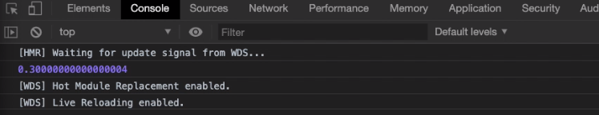

# La manipulation des nombres

* [Javasript et les nombres](#javasript-et-les-nombres)
* [Les outils mathématiques](#les-outils-mathmatiques)
    * [Math.round](#mathround)
    * [Math.floor](#mathfloor)
    * [toFixed](#tofixed)
    * [parseInt et parseFloat](#parseint-et-parsefloat)
    * [Math.random](#mathrandom)
    
## Javasript et les nombres

> **Il est très important de noter que javascript est un très mauvais language pour manipuler des nombres !!!**

* Par exemple si l'on veut faire une addition aussi simple que 0.1 + 0.2, le résultat attendu est évidemment 0.3, ce n'est
pas le cas en javascript:

```javascript
console.log(0.1 +0.2);
``` 

* On obtient comme résultat:



## Les outils mathématiques

> Il existe une librairie mathématique dans javascript qui s'appelle Math

#### Math.round

> Math.round est un outil qui arrondi un nombre

* Math.round arrondi à la valeur la plus proche du nombre entier, par exemple pour 10.4 le résultat sera 10, mais pour 10.8 le résultat sera 11,
 on l'écrit:

```javascript
console.log(Math.round(10.4));
``` 

#### Math.floor

> Math.floor est un outil qui supprime les chiffres après la virgule

* Math.floor supprime les chiffres après la virgule pour ne laisser qu'un nombre entier, on l'écrit:

```javascript
console.log(Math.floor(10.8));
``` 
Le résultat est 10

#### toFixed

> toFixed est un outil (qui n'appartient pas à la librairie Math mais s'en rapproche) qui permet de couper les chiffres après la virgule à une longueur voulue

* toFixed est un outil (qui n'appartient pas à la librairie Math mais s'en rapproche) qui permet de couper les chiffres
après la virgule à une longueur voulue, par exemple si l'on souhaite ne garder que 2 chiffres après la virgule (pour payer en euros par exemple), on l'écrit:

```javascript
console.log(10.6666678787856.toFixed(2));
``` 
Le résultat est 10.67

> A noter, en plus de couper le nombre au nombre de virgules souhaitées, toFixed arrondi le dernier chiffre après la virgule

* **Attention!! L'outil toFixed ne renvoie pas un nombre mais un string!!**

Exemple:

```javascript
console.log(10.6666678787856.toFixed(3) + 10);
``` 

Le résultat n'est pas l'addition de 10.667 + 10 mais la concaténation de '10.667' + '10', on obtient donc:


#### parseInt et parseFloat

> parseInt et parseFloat permettent tous deux de transformer un string en nombre

* parseInt est utiliser pour les nombres entiers et parseFloat pour les décimaux, on les écrit:

```javascript
console.log(parseInt('10') + 10);

console.log(parseFloat('10.67') + 10);
``` 
Le résultat est 20 et 20.67

#### Math.random

> Math.random crée un nombre aléatoire

* Math.random crée un nombre aléatoire compris entre 0 et 1 (1 étant exclu), on l'écrit:

```javascript
console.log(Math.random());
``` 
Le résultat est un nombre aléatoire entre 0 et 1 du type 0.651458511563

> A noter, en informatique l'aléatoire n'existe pas c'est un nombre pseudo aléatoire qui dépend du processeur et de la mémoire vive

* Pour obtenir un nombre plus grand, on peut écrire:

```javascript
console.log(Math.random() * 1000 + 1);
``` 

On obtient:


* Pour obtenir un nombre entier, on combine avec Math.floor, on écrit alors:

```javascript
console.log(Math.floor(Math.random() * 1000 + 1));
``` 

On obtient:


> Astuce: On ajoute 1 pour ne pas avoir 0

* Pour créer un nombre aléatoire compris entre 2 nombres, l faut alors créer une fonction:

```javascript
function createRandomNumber(min, max) {
  return Math.floor(min + Math.random() * (max - min) + 1);
}

console.log(createRandomNumber(10, 15));
``` 

On obtient:


