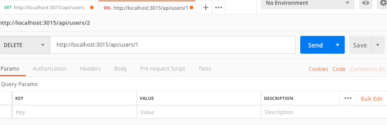
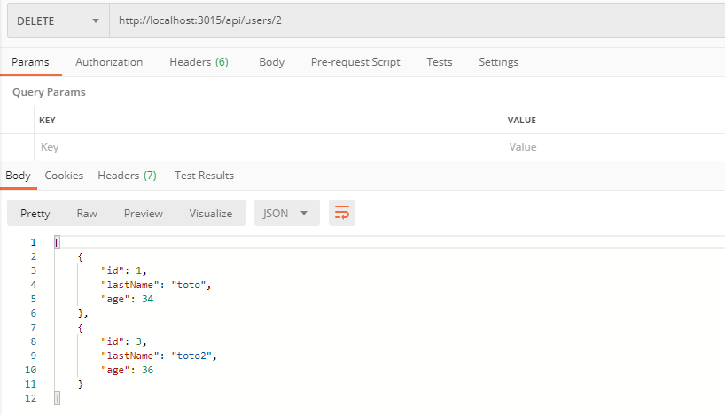
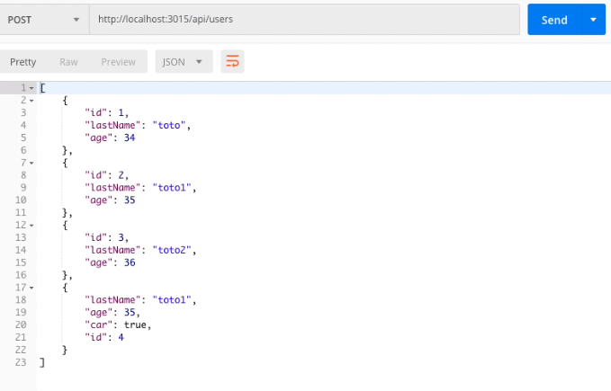
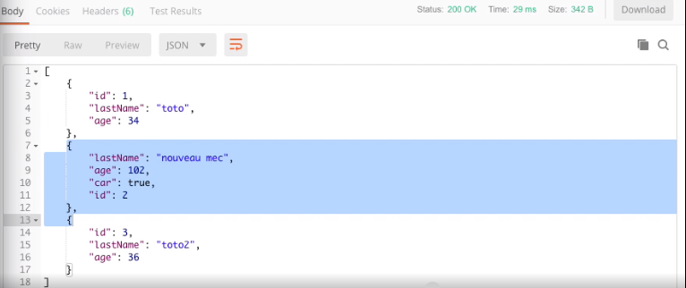
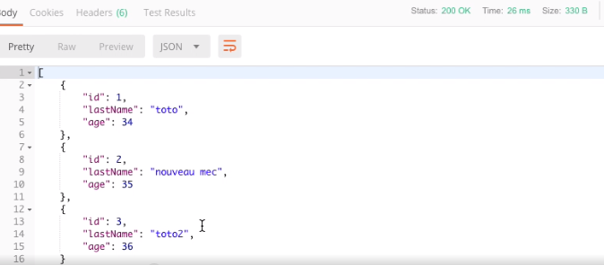

# Le CRUD (introduction)

* [Qu'est-ce que le CRUD ?](#quest-ce-que-le-crud-)
* [Qu'est-ce qu'une API ?](#quest-ce-quune-api-)
* [Get](#get)
* [Delete](#delete)
* [Post](#post)
* [Put](#put)
* [Patch](#patch)
* [Try Catch](#try-catch)
* [Les best practice](#les-best-practice)

> A noter, **les navigateurs internet n'utilisent que la requête get**, pour utiliser les autres verbes, il faut télécharger et
> utiliser un logiciel du type POSTMAN

## Qu'est-ce que le CRUD ?

Le CRUD est un acronyme qui signifie Create, Read, Update, Delete. Cela représente toutes les actions que l'on peut faire
sur une base de données (créer de nouveaux éléments, les lire, les modifiers et les supprimer). Pour cela o utilise des
actions qui sont définies par des verbes : Get, Delete, Post, Put et Patch.

## Qu'est-ce qu'une API ?

Une API est un contrat entre 2 ordinateurs pour savoir comment échanger des informations, des protocoles

## Get

> Le verbe get sert à faire une requête au serveur

Pour faire une requête get, on écrit:

```typescript
app.get('/api', (req, res) => {
    return res.send('Hello world!');
});
```
Cela signifie:

Je fais une **requête sur le serveur** (app.get) **avec pour URL '/api'**, j'ai **en paramètre ma requête** (req) et
**ma réponse** (res) **qui me retourne** (return) **un envoi du serveur de la réponse** à ma requête (res.send)

On peut aussi faire une requête avec des objets

```typescript
app.get('/api/user', (req, res) => {
    return res.send(user);
});
```
**Attention ! On ne peut pas appeler un nombre donc si l'on veut appeler user.age par exemple, il faudra le mettre dans un nouvel objet**

```typescript
app.get('/api/user/age', (req, res) => {
    return res.send({age: user.age});
});
```
## Delete

> Le verbe delete sert à demander au serveur de supprimer un élément de la base de données

Si l'on travaille avec la base de donnée suivante:


* Après avoir fait un GET des users, pour faire un delete, on écrit dans l'API :

```typescript
app.delete('/api/users/:id', async (req, res) => {
    const id = parseInt(req.params.id);
    console.log(id, typeof id);
    users = users.filter((user) => user.id !== id);
    return res.send(users);
});
```

Cela signifie:

Je fais une **requête pour supprimer dans le serveur** (app.delete) **avec pour URL '/api/users/:id'**, j'ai **en paramètre ma requête** (req) et
**ma réponse** (res) **qui me retourne** (return) **un envoi du serveur de la réponse** à ma requête (res.send) et qui
sert à **supprimer les users par id, on renvoie tous les user qui ont un id différent de la variable id** (users = users.filter((user) => user.id !== id))

* Puis on crée dans l'application Postman avec le verbe **delete** une route avec l'URL http://localhost:3015/api/users/2 :



* Tous les user sont renvoyé sauf celui qui à l'id 2 :



**Attention !!! Ne pas oublier de mettre un parseInt à la variable id, car par défaut le type est un string et non un number !**

## Post

> Le verbe post sert à faire une requête au serveur afin d'ajouter un élément de la base de données

* Il suffit de faire un push d'un nouvel objet, ceci dit, on ne connaît pas l'id de l'objet que l'on souhaite ajouter.

* Dans l'aplication Postman, il faut sélectionner le verbe post, entrer l'url des users (pas besoin d'id), puis entrer du
json (le json est un format d'échange de données js) en brut (raw) l'objet à ajouter:

```json
{
  "lastname": "toto1",
  "age": 35,
  "car": true
}
```


> Attention: dans json il faut mettre des doubles guillemets (" ") pour les strings mais aussi pour chaque attribut. Il faut
> aussi enlever la virgule à la fin d'un objet. On ne peut mettre que des strings, des numbers et des booleans.

* Dans l'IDE on écrit :

```typescript
app.post('/api/users', async (req, res) => {
    const newUser = req.body;
    const id = users.length + 1;
    users.push({...newUser, id});
    return res.send(users);
});
```

Cela signifie:

Je fais une **requête pour ajouter dans le serveur** (app.post) **avec pour URL '/api/users'**, j'ai **en paramètre ma requête** (req) et
**ma réponse** (res) **qui me retourne** (return) **un envoi du serveur de la réponse** à ma requête (res.send) et qui
sert à **ajouter un newUser et un id qui prend le numéro du dernier ID + 1 et on renvoie les users avec le newUser dedans**
(users.push({...newUser, id});)

> A noter: Afin d'utiliser le req.body il faut utiliser le bodyParser, pour cela il faut écrire dans l'IDE :
> 
> ```javascript
> import bodyParser from 'bodyParser';
> 
> app.use(bodyParser({}));
> ```



## Put

> Le verbe put sert à faire une requête au serveur afin de changer complétement un élément de la base de données

* Dans l'aplication Postman, il faut sélectionner le verbe put, entrer l'url des users avec l'id de l'user que l'on souhaite modifier,
puis entrer du json en brut l'objet modifié :

```json
{
  "lastname": "nouveau mec",
  "age": 102,
  "car": true
}
```

* Dans l'IDE on fait une recherche par index de l'objet à remplacer :

```typescript
app.put('/api/users/:id', async (req, res) => {
    const newUser = req.body;
    const id = parseInt(req.params.id);
    const index = users.findIndex((user) => user.id === id);
    users[index] = {...newUser, id}
    return res.send(users);
});
```

Cela signifie:

Je fais une **requête pour modifier complétement un objet dans le serveur** (app.put) **avec pour URL '/api/users/:id'**,
j'ai **en paramètre ma requête** (req) et **ma réponse** (res) **qui me retourne** (return) **un envoi du serveur de la réponse**
à ma requête (res.send) et qui sert à **modifier complétement un objet user à l'id indiqué et on renvoie l'user avec les
paramètres définis dans la variable newUser** (users[index] = {...newUser, id})



> A noter pour une grosse base de données ne jamais faire un return de res.send(users) mais faire un return de res.send({result: 'ok')

## Patch

> Le verbe patch sert à faire une requête au serveur afin de changer un ou plusieurs attributs d'un objet de la base de données

* Dans l'aplication Postman, il faut sélectionner le verbe patch, entrer l'url des users avec l'id de l'user que l'on souhaite modifier,
puis entrer du json en brut l'attribut à modifier :

```json
{
  "lastname": "nouveau mec",

}
```

* Dans l'IDE on fait une recherche par index de l'objet dont on veut modifier un ou plusieurs attribut(s) :

```typescript
app.put('/api/users/:id', async (req, res) => {
    const newUser = req.body;
    const id = parseInt(req.params.id);
    const index = users.findIndex((user) => user.id === id);
    users[index] = {...users[index], ...newUser, id}
    return res.send(users);
});
```

Cela signifie:

Je fais une **requête pour modifier un ou plusieurs attribut(s) d'un objet dans le serveur** (app.patch) **avec pour URL '/api/users/:id'**,
j'ai **en paramètre ma requête** (req) et **ma réponse** (res) **qui me retourne** (return) **un envoi du serveur de la réponse**
à ma requête (res.send) et qui sert à **modifier un ou plusieurs attribut(s) d'un objet user à l'id indiqué et on renvoie l'user avec les
paramètres définis dans la variable user à l'index donné et avec le ou les nouveaux attributs définis dans la variable newUser**
(users[index] = {...users[index], ...newUser, id})



**Attention!!! Il est de la responsabilité du développeur de bien vérifier que les informations que l'on envoie correspondent
bien avec la nature des attributs de notre base de données! Toujours prévoir des sécurités (avec des if et typeof), pour
que l'on ne puisse pas envoyer un boolean à la place d'un string ou modifier l'id...**

## Try Catch

> Le Try Catch signifie essaie le code (try) et s'il ya une erreur, afin d'éviter de faire crasher le serveur, récupère cette erreur (catch)

* **Pour toutes les routes il doit y avoir un try catch**

Dans le try, on insère notre requête et dans le catch on prévoit l'erreur possible, on l'afffiche et évite que le serveur plante :

```typescript
app.get('/api', async (req, res) => {
    try {
        return res.send('Hello World');
    } catch (e){
        console.log(e.message);
        return res
            .status(500)
            .send({error: 'erreur serveur', + e.message});
    }
});
```

* La bonne pratique est de stocker une fonction de requête dans un service :

Par exemple, dans notre exemple des hostels :

1: On crée le fichier de service 'hostels.service.ts' on y stocke et exporte la fonction de requête :

```typescript
import {HostelModel} from "./models/hostel.model";
import {getRoomIndexById} from './rooms.service';


export function getHostelById(hostels: HostelModel[], id: number): HostelModel | undefined {
    return hostels.find((hostel: HostelModel) => hostel.id === id);
}

export function manageRoomDelete(req: any, res: any, hostels: HostelModel[]) {
    const hostelId = parseInt(req.params.hostelId);
    const roomId = parseInt(req.params.roomId);
    const hostelToFind = getHostelById(hostels, hostelId);
    if (!hostelToFind) {
        throw new Error('hostel not found');
    }
    const indexOfRoomToDelete = getRoomIndexById(hostelToFind.rooms, roomId);
    if (!getRoomIndexById) {
        throw new Error('room not found');
    }
    hostels.splice(indexOfRoomToDelete, 1);
    return res.send({message: 'delete ok'});
}
```

2: Dans le fichier serveur.ts, on vient faire notre try catch en faisant appelle à la fonction que l'on veut essayer :

```typescript
app.delete('/api/hostels/:hostelId/rooms/:roomId', (req, res) => {
        try {
            return manageRoomDelete(req, res, hostels);
    }
    catch (e) {
            console.error(e.message);
            return res
                .status(500)
                .send(e.message);
    }
});
```

> À noter, le status 500 est une erreur interne du serveur (error 500 (internal server error))


## Les best practice

> Pour rappel :
>
> Pour [créer une db (Firebase)](https://gitlab.com/olivier_portal/mes-cours/-/blob/master/tools/firebase/firebase.md#cr%C3%A9er-une-bdd-firebase)
> et [administrer une db en node](https://gitlab.com/olivier_portal/mes-cours/-/blob/master/Languages/node/04-administrer%20une%20base%20de%20donn%C3%A9es.md)
>
> Les raccourcis :
>
> Importer une fonction => Alt + Entrée
>
> Ouvrir un objet à son emplacement => Ctrl + Clic

-----------

* Créer un dossier model dans lequel on vient typer les objets utiliser dans des fichiers séparés, par exemple :

Pour un objet hostel, on crée un fichier hostel.model.ts dans lequel on type l'objet

```typescript
export interface HostelModel {
    id?: number | string;
    name: string;
    roomNumbers: number;
    pool: boolean;
    rooms: number[];
}
```

* Toujours travailler dans un dossier service (le dossier est au service du serveur) et y mettre les fonctions, par exemple :

Pour un objet hostel, on crée un fichier hostel.service.ts dans lequel on écrit les fonctions au service du serveur

```typescript
import {HostelModel} from "../models/hostel.model";
import admin from "firebase-admin";
import {cert} from "../cred/cert";
import DocumentReference = FirebaseFirestore.DocumentReference;
import DocumentData = FirebaseFirestore.DocumentData;

admin.initializeApp({
    credential: admin.credential.cert(cert),
    databaseURL: "https://node-lab-d228c.firebaseio.com"
});

export function getHostelById(hostels: HostelModel[], id: number): HostelModel | undefined {
    return hostels.find((hostel: HostelModel) => hostel.id === id);
}

const db = admin.firestore();

const refHostels = db.collection('hostels');

export async function postNewHostel(newHostel: HostelModel): Promise<HostelModel> {
    if (!newHostel) {
        throw new Error('new hostel must be filled');
    }
    const addResult: DocumentReference<DocumentData> = await refHostels.add(newHostel);
    return {...newHostel, id: addResult.id};
}
```

* Réserver le serveur (server.ts) pour les requêtes, par exemple :

```typescript
import express from 'express';
import cors from 'cors';
import bodyParser from 'body-parser';

import {postNewHostel} from "./service/hostels.service";

const app = express();
app.use(cors());
app.use(bodyParser.json({}));

app.post('/api/hostels', async (req, res) => {
    try {
        const newHostel = req.body;
        const addResult = await postNewHostel(newHostel);
        return res.send(addResult);
    } catch (e){
        return res.status(500).send({error: 'erreur serveur' + e.message});
    }
});
```

> À noter : Une bonne pratique est d'aller voir à la source les définitions des fonctions et objets, par exemple :
>
> Pour add(), aller voir sa définition :
>
> ```typescript
>  /**
>       * Add a new document to this collection with the specified data, assigning
>       * it a document ID automatically.
>       *
>       * @param data An Object containing the data for the new document.
>       * @return A Promise resolved with a `DocumentReference` pointing to the
>       * newly created document after it has been written to the backend.
>       */
>      add(data: T): Promise<DocumentReference<T>>;
>  ```
>
> On sait alors que la fonction add() ajoute un nouveau document à une collection et lui assigne automatiquement une id


**Attention !!!** Avant de modifier une fonction, vérifier qu'il n'y a pas 'd'**effet de bords**', c'est-à-dire que la fonction
n'est pas utilisée dans différents contextes et dont les modifications pourraient casser des requêtes.


