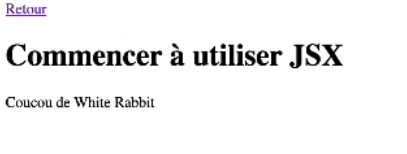
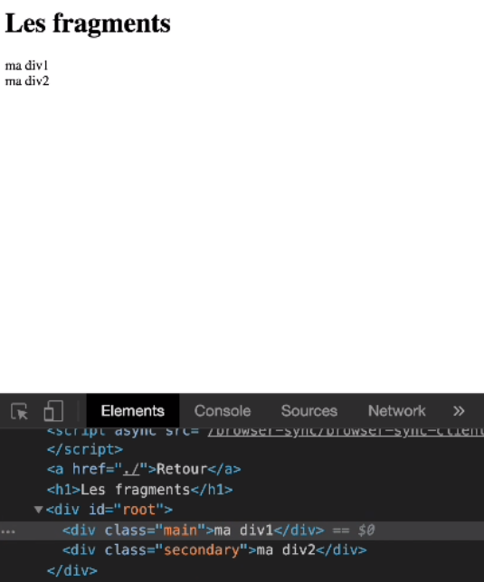

# JSX

* [Qu'est-ce que JSX ?](#quest-ce-que-jsx-)
* [Déstructurer avec props](#déstructurer-avec-props)
* [Les fragments](#les-fragments)

## Qu'est-ce que JSX ?

> les fichiers jsx permettent de mélanger du html et du javascript grâce à une nouvelle compilation. Nous utiliserons
> un compilateur qui s'appelle Babel

Pour installer Babel, aller sur le site [babeljs.io](#https://babeljs.io/setup), puis dans setup, et copier/coller le script :

```html
<script src="https://unpkg.com/@babel/standalone/babel.min.js"></script>
```

puis indiqué que l'on veut écrire du texte grâce à babel :

```html
<script type="text/babel"></script>
```

On pourra donc écrire une version plus lisible de javascript qui ressemble au html grâce à la librairie React et au compilateur
Babel :

```html
<script type="text/babel">
  const value = 'React';
  const version = React.version;

  const getString = (a, b) => a + b;

  const root = document.getElementById('root');

  const exampleDiv = <div className="main">
    Bienvenue dans l'initiation à {getString('Re', 'act')} (version {version})
  </div>;

  ReactDOM.render(exampleDiv, root);
</script>
```

> A noter : L'interpolation en JSX n'utilise pas de symbole $, on écrit simplement entre accolades

## Déstructurer avec props

En JSX on peut appeler un objet en le déstructurant, plutôt que d'appeler plusieurs objets différents :

```html
<script type="text/babel">

  const root = document.getElementById('root');
  const className = 'main';
  const children = 'coucou de White Rabit';

  const props = {children, className};

  const exampleDiv = <div {...props}>;

  ReactDOM.render(exampleDiv, root);
</script>
```

Cela permet d'écrire du code plus court en ayant le même résultat :



Avec la class qui est bien égale à main :


JSX reconnaît que children est ce qui se trouve à l'itérieur de balises HTML. Le sautres appeleations créeront des attributs,
exemple :

```html
<script type="text/babel">

  const root = document.getElementById('root');
  const className = 'main';
  const toto = 'coucou de White Rabit';

  const props = {toto, className, children: 'salut', type: 'button'};

  const exampleDiv = <div {...props} />;

  ReactDOM.render(exampleDiv, root);
</script>
```

On obtient des attributs de balises HTML :


## Les fragments

Afin d'éviter d'avoir des divs inutiles, on peut utiliser les fragments. Il suffit d'ouvrir et fermer des balises vides :

```html
<script type="text/babel">

  const root = document.getElementById('root');
  const className1 = 'main';
  const children1 = 'ma div1';

  const className2 = 'secondary';
  const children2 = 'ma div2';

  const props1 = {
        className1,
        children1
    };

  const props2 = {
        className2,
        children2
    };

  const exampleDiv = <>
        <div {...props1} />
        <div {...props2} />
    </>

  ReactDOM.render(exampleDiv, root);
</script>
```

On obtient alors 2 divs correspondants à prop1 et prop2, à plat, sans avoir besoin d'jouter une div vide inutile :


