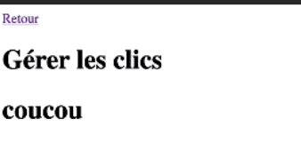
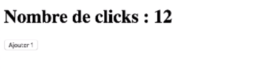
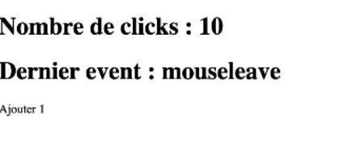
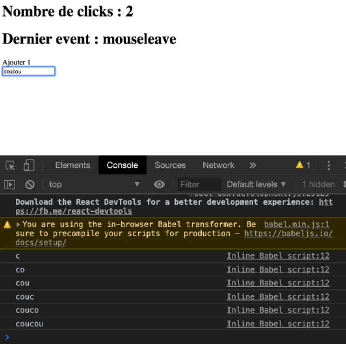

# Gérer les évènements

* [Créer une application racine](#gérer-les-évènements)
* [Gérer les clicks](#gérer-les-clicks)
* [Gérer les events](#gérer-les-events)
* [Gérer les états proprement](#gérer-les-états-proprement)

## Créer une application racine

L'application racine est l'application qui contient toutes les autres applications. On l'appelle App. Exemple :

```angular2html
<script type="text/babel">
    
    function App() {
      return (
        <>
            <h1>coucou</h1>
        </>
      );
    }

    function renderApplication() {
      ReactDOM.render(<App/>, document.getElementById('root'));
    }
    
    renderApplication();

</script>
```

On obtient bien le rendering de App :



## Gérer les clicks

Pour gérer les clicks (ou les events en général) on crée une fonction à l'intérieur de la fonction App, ainsi qu'une
variable de l'état de l'event.

Attention ! En react on travaille avec des immutables ! On ne change jamais un objet ! Il faut créer un nouvel objet qui
prend en compte les changements de l'objet.

```angular2html
<script type="text/babel">

    const state = {count: 0};
    
    function App() {

      function handleClick() {
        setState({count: state.count + 1});
      }
      return (
        <>
            <h1>nombre de clicks : {state.count}</h1>
            <button onClick={handleClick}>Ajouter 1</button>
        </>
      );
    }

    function setState(newState) {
      Object.assign(state, newState);
      renderApplication();
    }

    function renderApplication() {
      ReactDOM.render(<App/>, document.getElementById('root'));
    }
    
    renderApplication();

</script>
```

Le bouton s'incrémente bien d'un à chaque click :



> Quand o retourne une fonction, ne jamais mettre les parenthèses après !!!

## Gérer les events

> Avec React on peut gérer tous les events (tout ce qui se passe dans le browser)

On peut par exemple, écouter et afficher les mouvements de la souris :

```angular2html
<script type="text/babel">

    const state = {count: 0};
    
    function App() {

      function handleEvent(event) {
        setState({count: state.count + 1, lastEventType: event.type});
      }
      return (
        <>
            <h1>Nombre de clicks : {state.count}</h1>
            <h1>Dernier event : {state.lastEventType}</h1>
            <button
                onClick={handleEvent}
                onMouseEnter={handleEvent}
                onMouseLeave={handleEvent}
            >
                Ajouter 1
            </button>
        </>
      );
    }

    function setState(newState) {
      Object.assign(state, newState);
      renderApplication();
    }

    function renderApplication() {
      ReactDOM.render(<App/>, document.getElementById('root'));
    }
    
    renderApplication();

</script>
```

On récupère bien les mouvements de la souris lorsque l'on passe dessus le bouton
ou lorsqu'on enlève la souris de celui-ci.



À noter : les inputs se gèrent différemment, on écrit :

```angular2html
<script type="text/babel">

    const state = {count: 0};
    
    function App() {

      function handleEvent(event) {
        setState({count: state.count + 1, lastEventType: event.type});
      }

      function handleInputChange(event) {
        console.log(event.target.value)
      }
      return (
        <>
            <h1>Nombre de clicks : {state.count}</h1>
            <h1>Dernier event : {state.lastEventType}</h1>
            <button
                onClick={handleEvent}
                onMouseEnter={handleEvent}
                onMouseLeave={handleEvent}
            >
                Ajouter 1
            </button>
            <input type="text" onChange={handleInputChange}/>
        </>
      );
    }

    function setState(newState) {
      Object.assign(state, newState);
      renderApplication();
    }

    function renderApplication() {
      ReactDOM.render(<App/>, document.getElementById('root'));
    }
    
    renderApplication();

</script>
```

On obtient alors dans la console chaque caractère tapé sur le clavier :




## Gérer les états proprement

> React nous permet de gérer les états proprement grâce à une fonction prédéfinie 'React.useState', cela renvoie un tableau
> de deux données [state, setState]

Afin de ne pas mettre à jour tous les états, il faut bien penser à importer le state de façon déstructuré :

```angular2html
<script type="text/babel">

    function App() {

      const [state, setState] = React.useState({
        count: 0,
        lastEventType: ",
        name: "
    });

      function handleEvent(event) {
        setState({
            ...state,
            count: state.count + 1,
            lastEventType: event.type,
        });
      }

      function handleInputChange(event) {
        console.log(event.target.value)
        setState({...state, name: event.target.value})
      }
      return (
        <>
            <h1>Bonjour : {state.name}</h1>
            <h1>Nombre d'events : {state.count}</h1>
            <h1>Dernier event : {state.lastEventType}</h1>
            <button
                onClick={handleEvent}
                onMouseEnter={handleEvent}
                onMouseLeave={handleEvent}
            >
                Ajouter 1
            </button>
            <input type="text" onChange={handleInputChange}/>
        </>
      );
    }

    function renderApplication() {
      ReactDOM.render(<App/>, document.getElementById('root'));
    }
    
    renderApplication();

</script>
```

On obtient bien une mise à jour des états gérée par React propement :


