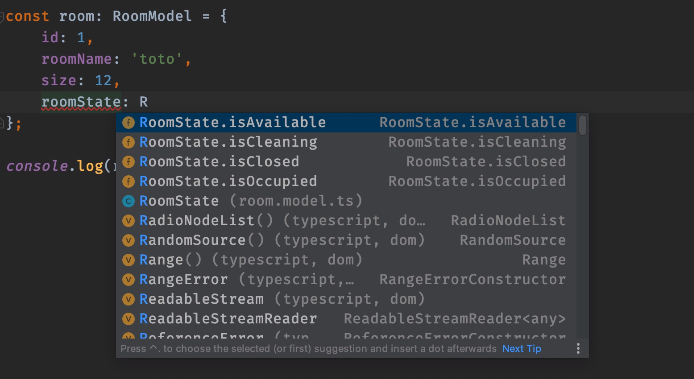

# Les enums

* [Pourquoi les énumérations ?](#pourquoi-les-énumérations-?)
* [Les énumérations](#les-énumérations)
* [Set enum state](#set-enum-state)
* [Get enum state](#get-enum-state)

## Pourquoi les énumérations ?

Lorsque dans un objet on doit gérer des états, par exemple pour une chambre d'hôtel, son état peut-être occupée, libre,
en nettoyage etc.

Gérer ses états directement dans l'objet est impossible, car la valeur de l'état (qui est un boolean) ne peut-être à la
fois du type : occupée = true et libre = true ou encore lire = true et en nettoyage = true...

Il faut don faire des énumérations.

## Les énumérations

> les énumérations sont, comme les interfaces, des modèles qui permettent de décrire différents états et chaque état
> doit être unique (on ne peut pas avoir 2 états en même temps)

* On écrit donc dans le fichier room.model.ts :

```typescript
export interface RoomModel {
    id: number;
    roomName: string;
    size: number;
    roomState: RoomState;
}

export enum RoomState {
    isAvailable = 'est libre',
    isCleaning = 'en nettoyage',
    isOccupied = 'occupée',
    isClosed = 'en travaux',
}
```
On ajoute donc un roomState dans l'interface RoomModel de type RoomState, puis on crée un enum avec les différents états possibles

> À noter : On met des virgules et non des points virgules. Le string à côté de chaque état concerne l'utilisateur, il peut
> donc être en français ou dans n'importe quelle langue

* On peut alors créer un objet room de type RoomModel avec l'état de la chambre (room) :

```typescript
const room: RoomModel = {
    id: 1,
    roomName: 'Chambre Océan',
    size: 4,
    roomState: RoomState.isAvailable,
}
```

> À noter : L'autocomplétion est active, e qui nous permet de sélectionner l'état rapidement :
>
> 

## Set enum state

* Dans le fichier room.service.ts, on va d'abord créer une fonction qui vérifie que l'état demander est correct :

```typescript
function checkRoomState(state: any) {
  return Object.keys(RoomState).some((roomState) => roomState === state);
}
```

Cela signifie :

Vérifie que peu-importe l'état de la chambre demandée, il correspond bien à au moins un état défini dans l'énumération de RoomState

* Puis on crée une fonction du type setObjectByState :

```typescript
export async function setRoomByState(roomId: string, state: RoomState): Promise<string> {
    if (!roomId) {
        throw new Error('roomId is missing');
    }
    if (!checkRoomState(state)) {
        throw new Error('state is invalid');
    }
    const roomRef: DocumentReference = roomsRef.doc(roomId);
    const roomSnap: DocumentSnapshot = await roomRef.get();
    if (!roomSnap.exists) {
        throw new Error(`room ${roomId} does not exist`);
    }
    await roomRef.update({roomState: state});
    return 'ok';
}
```

Cela signifie :

Si l'id n'est pas renseigné envoie une erreur 'roomId is missing', et si l'état de la room n'est pas au bon format envoie
une erreur 'state is invalid', sinon récupère une image momentanée de la room depuis le serveur. Si cette room n'existe pas
envoie une erreur 'room does not exist' sinon envoie une mise à jour de l'état de la chambre définie dans le paramètre state
Puis renvoie-moi 'ok' si tout c'est bien passé.

* On écrit alors dans le fichier server.ts :

```typescript
app.patch('/api/hostels/:id/state', async (req, res) => {
    try {
        const roomId: string = req.params.id;
        const state: RoomState = req.body.roomState;
        const operationResult: string = await setRoomByState(roomId, state);

        return res.send(operationResult);
    } catch (e){
        return res.status(500).send({error: 'erreur serveur' + e.message});
    }
});
```

Cela signifie :

Je mets à jour l'état de la room (patch), je récupère l'id de la room et la mise à jour de l'état de la room du body de postman
et je demande au serveur de mettre à jour l'état de la chambre avec l'id donnée.

* Il faut maintenant créer la mise à jour de l'état de la chambre dans postman :

> Astuce : Plutôt que d'entrée l'id dans l'url directement on peut écrire l'URL HTTP://localhost:3015/api/rooms/:roomId/state
> puis ajouter l'id dans les paramètres de postman :
> 
> 

On écrit alors dans le body en json :

```json
{
    "roomState": "isClosed"
}
```

Le serveur, après appel, nous renvoie bien 'ok' :


La base de données est bien mise à jour :


## Get enum state

* Dans le fichier rooms.service.ts, on écrit :

```typescript
export async function getRoomState(roomId: string): Promise<RoomState> {
    const room: RoomModel = await getRoomById(roomId);
    return room.roomState;
}
```

Cela signifie :

Récupère une room par son id grâce à la fonction getRoomById, et renvoie-moi l'état de la room

* Dans server.ts, on a plus qu'à faire un get :

```typescript
app.get('/api/rooms/:roomId', async (req, res) => {
    try {
        const roomId: string = req.params.roomId;
        const state: RoomState = await getRoomState(roomId);
        return res.send({state});
    } catch (e){
        return res.status(500).send({error: 'erreur serveur' + e.message});
    }
});
```

On obtient bien l'état sous forme d'objet :


