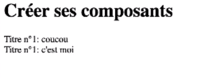

# Créer des composants

* [Créer un composant](#créer-un-composant)
* [Typer un composant en js](#typer-un-composant-en-js)
* [Spécifier les types dans ses props](#typer-un-composant-en-js)

## Créer un composant

> Pour créer un composant (component), on crée une fonction dont le nom doit commencer par une majuscule et qui prend en paramètres
> des props

Par exemple pour créer un component de titre, on écrit une fonction avec des paramètres que l'on récupère sous forme de props
et qui retourne une div. On crée ensuite une variable qui fait appelle à la fonction sous forme de balise HTML. Puis on
fait notre rendering :

```angular2html
<script type="text/babel">

const root = document.getElementById('root');

function MyTitle(className, children, number) {
    const props = {
        children: `Titre n° ${number}: ${children}`,
        className,
    };
    return <div {...props} />
}

const exampleDiv = 
    <div>
        <MyTitle className="main" number="1">coucou</MyTitle>
        <MyTitle className="secondary" number="1">c'est moi</MyTitle>
    </div>

    ReactDOM.render(exampleDiv, root)

</script>
```

On obtient bien l'affichage souhaité :



Cela sert à réutiliser le composant si par exemple on a un bouton ou tout autre élément qui revient souvent

## Typer un composant en js

Afin de bien typer les components en js, il faut pour les primitives autres que les strings, utiliser l'interpolation :

```angular2html
<script type="text/babel">
  const root = document.getElementById('root');

  function Hello({firstName, lastName, age, car}) {
    return (
        <div>
          Bonjour je m'appelle {firstName} {lastName} et j'ai {age} an(s)!
        </div>
    );
  }

  const exampleDiv = <Hello
      lastName='Bianchi'
      age={17}
      car={true}
  />;

  ReactDOM.render(exampleDiv, root);
</script>
```

## Spécifier les types dans ses props

Si on veut vérifier le type des éléments dans ses props il faut faire un lien vers la librairie props type, puis préciser
le type et s'il est obligatoire ou non, grâce à la propriété propTypes. Cela sert à indiquer si les données sont bien envoyées sous la bonne forme :

```angular2html
<script src="https://unpkg.com/prop-types@15.6/prop-types.js"></script>

<script type="text/babel">
  const root = document.getElementById('root');

  function Hello({firstName, lastName, age, car}) {
    return (
        <div>
          <div>age : {typeof age}</div>
          <div>car : {typeof car}</div>
          Bonjour je m'appelle {firstName} {lastName} et j'ai {age} an(s)!
        </div>
    );
  }

  Hello.propTypes = {
    lastName: PropTypes.string.isRequired,
    age: PropTypes.number.isRequired,
    car: PropTypes.bool,
  };

  const exampleDiv = <Hello
      lastName='Bianchi'
      age={17}
      car={true}
  />;

  ReactDOM.render(exampleDiv, root);
</script>
```

Le component marchera quoiqu'il arrive, mais un message d'erreur s'affiche. Cela permet de montrer à d'autres dev qu'ils envoient
les données aux mauvais formats ou de récupérer une erreur d'un utilisateur et de lui afficher l'erreur. On obtient l'erreur
dans la console tel que :


