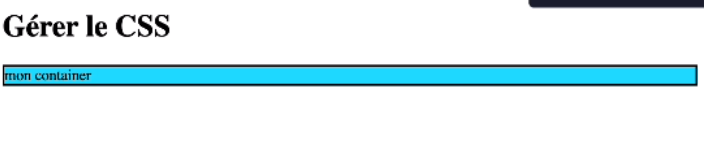

# Gérer le css

* [Intégrer du css](#intégrer-du-css)
* [Changer le style d'un component répété](#changer-le-style-dun-component-répété)

## Intégrer du css

> Le style est à l'intérieur du component

Pour intégrer du css, il suffit de créer ses classes css, puis de les appeler dans la div avec la propriété className :

```angular2html
<style>
    .container {
        border: 2px solid black;
    }

    .bg-blue {
        background-color: #1edcff;
    }

    .bg-red {
        background-color: #ff5454;
    }
</style>

<script type="text/babel">
  const root = document.getElementById('root');

  function Box({...props}) {
    return (
        <div
            className={`container`}
            {...props}
        />
    );
  }

  const exampleDiv = (
      <>
        <Box className="container bg-blue">
          mon container
        </Box>
      </>
  );

  ReactDOM.render(exampleDiv, root);
</script>
```

On obtient bien le style de la classe container et bg-blue :



## Changer le style d'un component répété

Pour ajouter un style différent sur un même component répété, il faut ajouter un paramètre à la fonction (en plus de props)
et utiliser le style dans la variable :

```angular2html
<style>
    .container {
        border: 2px solid black;
    }

    .bg-blue {
        background-color: #1edcff;
    }

    .bg-red {
        background-color: #ff5454;
    }
</style>

<script type="text/babel">
  const root = document.getElementById('root');

  function Box({className, ...props}) {
    return (
        <div
            className={`container ${className}`}
            {...props}
        />
    );
  }

  const exampleDiv = (
      <>
        <Box className="bg-blue">
          mon container
        </Box><Box className="bg-red">
          mon container
        </Box>
      </>
  );

  ReactDOM.render(exampleDiv, root);
</script>
```

> Attention à toujours mettre props à la fin car les classes non utilisées seront toujours affichées


On peut utiliser les propriétés css du type 'style' à condition de les interpoler :

```angular2html
<script type="text/babel">
  const root = document.getElementById('root');

  function Box({className, ...props}) {
    return (
        <div
            className={`container ${className}`}
            {...props}
        />
    );
  }

  const exampleDiv = (
      <>
        <Box className="bg-blue"
        style={
            {color: 'white'}        
        }>
          mon container
        </Box><Box className="bg-red">
          mon container
        </Box>
      </>
  );

  ReactDOM.render(exampleDiv, root);
</script>
```
