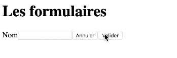

# Les formulaires

* [La structure d'un formulaire](#la-structure-dun-formulaire)
* [Récupérer les valeurs d'un formulaire](#récupérer-les-valeurs-dun-formulaire)

## La structure d'un formulaire

La structure d'un formulaire est similaire à celle du HTML, il faut des label (nom du champs à renseigner), des input 
(Le champ à renseigner) et des buttons (envoyer ou annuler). A noter cependant qu'il faudra modifier le comportement par défaut du HTML
, par exemple, on ne veut pas que lorsque l'on clic sur envoyer cela recharge la page :

```angular2html
<script type="text/babel">
    
    function MyForm() {

        function handleSubmit(event) {
          event.preventDefault();
          console.log('coucou');
        }

      return (
       <form onSubmit={handleSubmit}>
            <label htmlFor="name">Nom</label>
            <input id="name"/>
            <button type="button">Annuler</button>
            <button type="submit">Valider</button>
       </form>
      );
    }

    function renderApplication() {
      ReactDOM.render(<MyForm/>, document.getElementById('root'));
    }
    
    renderApplication();

</script>
```

On obtient bien notre formulaire structuré :



## Récupérer les valeurs d'un formulaire

Afin de récupérer les valeurs d'un formulaire, il va falloir créer une fonction pour gérer les submits et une pour gérer
les inputs. Dans la fonction des inputs (afin de ne pas la réécrire pour chaque input), il va falloir récupérer son id.
Il nous faudra aussi sa value et son type (car par défaut un formulaire renvoie un string même si la donné de départ est un number)

On écrit alors :

```angular2html
<script type="text/babel">
    
    function MyForm() {

        const [state, setState] = React.useState({name: '', age: null});

        function handleSubmit(event) {
          event.preventDefault();
          console.log(state);
        }

        function handleInput(event) {
          const {id, value, type} = event.target;
          setState({
            ...state,
            [id]: type === 'number' ? parseInt(value) : value,
          })
        }

      return (
       <form onSubmit={handleSubmit}>
            <label htmlFor="name">Nom</label>
            <input
                value={state.name}
                onChange={handleInput}
                type="text" id="name"/>
            <label htmlFor="age">Age</label>
            <input
                value={state.age}
                onChange={handleInput}
                type="text" id="age"/>
            <button type="button">Annuler</button>
            <button type="submit">Valider</button>
       </form>
      );
    }

    function renderApplication() {
      ReactDOM.render(<MyForm/>, document.getElementById('root'));
    }
    
    renderApplication();

</script>
```

On obtient bien les valeurs en retour :


