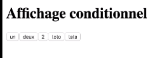

# Affichage conditionnel

* [Créer un affichage conditionnel](#créer-un-affichage-conditionnel)
* [Afficher une liste](#afficher-une-liste)
* [Passer des fonctions en props](#passer-des-fonctions-en-props)

## Créer un affichage conditionnel

Un affichage conditionnel sert à afficher différents composants suivant les cas. On utilise comme son nom l'indique des conditions
 if ou switch :

```angular2html
<script type="text/babel">
    
    function Un() {
      return <h1>Je suis Un</h1>
    }

    function Deux() {
      return <h1>Je suis Deux</h1>
    }

    function Trois() {
      return <h1>Je suis Trois</h1>
    }

    function ManageDisplay({value}) {
      switch (value) {
        case 1:
            return <Un/>;
        case 2:
            return <Deux/>;
        case 3:
            return <Trois/>;
        default:
            return null;
      }
    }

    function App() {
      return <>
        <ManageDisplay value={2}/>
      </>
    }

    function renderApplication() {
      ReactDOM.render(<MyForm/>, document.getElementById('root'));
    }
    
    renderApplication();

</script>
```

On obtient bien suivant la valeur un affichage différent, dans notre cas on affiche la fonction Deux :


## Afficher une liste

On peut également afficher une liste que l'on stocke dans une variable d'array. Pour cela on crée une première fonction qui
permet d'afficher la liste et une autre qui calcule les valeurs à afficher :

```angular2html
<script type="text/babel">
    
    function Touche(props) {
      return <button>{props.display}</button>
    }

    const liste = ['un', 'deux', 2, 'toto', 'tata'];

    function Calc() {
      return liste.map((value, index) => 
        <Touche display={value} key{index}/>,
      );
    }

    function App() {
      return <>
        <Calc/>
      </>
    }

    function renderApplication() {
      ReactDOM.render(<MyForm/>, document.getElementById('root'));
    }
    
    renderApplication();

</script>
```

On obtient bien une liste constituée des valeurs de notre tableau :



Attention ! Toujours ajouter un index aux valeurs afin de pouvoir travailler proprement. 

## Passer des fonctions en props

> Il arrive souvent que l'on doive manipuler des données qui sont répartis entre plusieurs components

Dans notre exemple précédent, nous avons 3 components : 

1. App
2. Calc
3. Touche

Le component App fait un appel au component Calc qui va lui-même chercher la valeur passée dans le component Touche

Si l'on veut récupérer la dernière valeur sélectionnée et la passée dans la fonction App, il faut créer des liens entre les
components.

Étape 1 : On crée sa balise dans App qui récupérera la valeur :

```angular2html
<script type="text/babel">
    
    function Touche(props) {
      return <button>{props.display}</button>
    }

    const liste = ['un', 'deux', 2, 'toto', 'tata'];

    function Calc() {
      return liste.map((value, index) => 
        <Touche display={value} key{index}/>,
      );
    }

    function App() {
      return <>
        
        //=========CREATION DE LA BALISE============

        <h1>La dernière valeur est : </h1>

        <Calc/>
      </>
    }

    function renderApplication() {
      ReactDOM.render(<MyForm/>, document.getElementById('root'));
    }
    
    renderApplication();

</script>
```

Étape 2 : On prépare l'état que l'on va récupérer dans App avec une valeur par défaut 'display: null' :

```angular2html
<script type="text/babel">
    
    function Touche(props) {
      return <button>{props.display}</button>
    }

    const liste = ['un', 'deux', 2, 'toto', 'tata'];

    function Calc() {
      return liste.map((value, index) => 
        <Touche display={value} key{index}/>,
      );
    }

    function App() {
//=========PREPARER L'ETAT QUE L'ON VEUT RÉCUPÉRER============

      const [state, setState] = React.useState(display: null);

      return <>        
        <h1>La dernière valeur est : </h1>
        <Calc/>
      </>
    }

    function renderApplication() {
      ReactDOM.render(<MyForm/>, document.getElementById('root'));
    }
    
    renderApplication();

</script>
```

Étape 3 : Dans le component Touche, on ajoute l'action à exécuter, mais il faut lui passer en paramètre le props.display
afin qu'il soit lu, pour ce faire, il faut passer une fonction anonyme qui s'auto-exécute :

```angular2html
<script type="text/babel">
    
    function Touche(props) {

//=========AJOUT DE L'ACTION A EXECUTER BIEN PENSER A AJOUTER EN PARAMETRE LE DISPLAY AVEC UNE FONCTION ANONYME============

      return <button onClick={() => props.action(props.display)}>{props.display}</button>
    }

    const liste = ['un', 'deux', 2, 'toto', 'tata'];

    function Calc() {
      return liste.map((value, index) => 
        <Touche display={value} key{index}/>,
      );
    }

    function App() {

      const [state, setState] = React.useState(display: null);

      return <>        
        <h1>La dernière valeur est : </h1>
        <Calc/>
      </>
    }

    function renderApplication() {
      ReactDOM.render(<MyForm/>, document.getElementById('root'));
    }
    
    renderApplication();

</script>
```

Étape 4 : On passe l'action à exécuter dans Calc :

```angular2html
<script type="text/babel">
    
    function Touche(props) {
      return <button onClick={() => props.action(props.display)}>{props.display}</button>
    }

    const liste = ['un', 'deux', 2, 'toto', 'tata'];

    function Calc() {
      return liste.map((value, index) => 

//=========PASSAGE DE L'ACTION A EXECUTER DANS CALC============

        <Touche action={props.action} display={value} key{index}/>,
      );
    }

    function App() {

      const [state, setState] = React.useState(display: null);

      return <>        
        <h1>La dernière valeur est : </h1>
        <Calc/>
      </>
    }

    function renderApplication() {
      ReactDOM.render(<MyForm/>, document.getElementById('root'));
    }
    
    renderApplication();

</script>
```

Étape 5 : On ajoute une fonction anonyme qui prend en paramètre display qui va être passé à son tour en paramètre à la
fonction setState puis on la retourne dans l'appelle de Calc afin de l'exécuter, et on ajoute la valeur à afficher :

```angular2html
<script type="text/babel">
    
    function Touche(props) {
      return <button onClick={() => props.action(props.display)}>{props.display}</button>
    }

    const liste = ['un', 'deux', 2, 'toto', 'tata'];

    function Calc() {
      return liste.map((value, index) => 
        <Touche action={props.action} display={value} key{index}/>,
      );
    }

    function App() {

      const [state, setState] = React.useState(display: null);

//=========AJOUT DE LA FONCTION ANONYME QUI RECUPERE L'ACTION DISPLAY============

      const handleState = (display) => setState(display);

      return <>

//=========AJOUT DE LA VALEUR A AFFICHER============

        <h1>La dernière valeur est : {state.display}</h1>

//=========RETOUR DE LA FONCTION ANONYME AFIN DE L'EXECUTER============

        <Calc action={handleState}/>
      </>
    }

    function renderApplication() {
      ReactDOM.render(<MyForm/>, document.getElementById('root'));
    }
    
    renderApplication();

</script>
```

On obtient bien un affichage de la Touche grâce à la fonction Calc que l'on appelle dans App :


