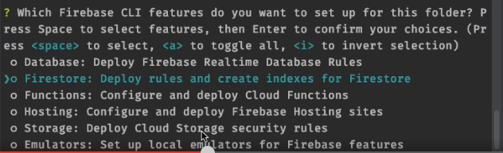
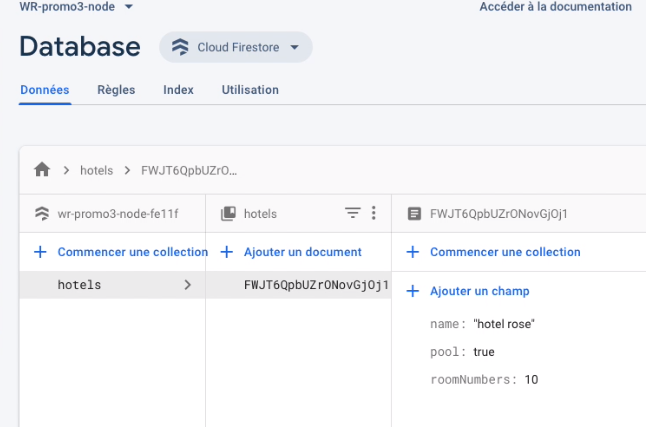
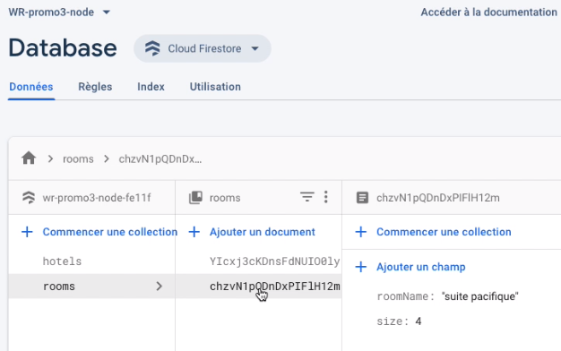

# firebase

* [Utiliser Firebase](#utiliser-firebase)
* [deploy sur firebase](#deploy-sur-firebase)
* [Créer une BDD firebase](#créer-une-bdd-firebase)
* [Administrer une BDD](#administrer-une-bdd)

## Utiliser Firebase:

> **firebase est une architecture à son service qui permet de manager des projets**

* Aller sur le site [firebase](https://firebase.google.com/?hl=fr)
* Créer un nouveau projet (bien le nommer !)
* Le lier avec son compte google analytics
* On peut désormais mettre en ligne des sites internets, des Db (architectre serveless)
* On héberge dans son site dans la partie hosting

## deploy sur firebase

* Installer firebase dans son projet webstorm
* Ouvrir la console

        npm i -g firebase-tools

    _Pour info -g dans la console signifie général_

* Sur la page principale index.html pour deploy le site il faut entre dans la console:

        firebase init hosting

    **Attention si l'on a un message d'erreur indiquant que l'on est pas connecté il faut entrer la commande:**

        firebase login
        
     **Attention Si l'installation ne se fait pas sur MAC, il faut vérifier les droits sur le dossier en utilisant la commande:**

        sudo chown -R $USER:$(id -gn $USER) $HOME/.config.

* Sélectionner l'endroit où on veut hoster le site
* Pour une single-page app (rect ou angular) choisr Y (yes) sinon N (No)
* Overwrite -> N
* Cela crée un fichier firebase.json
* Dans ce fichier ignorer les package.json et package-lock.json (inutile de les avoir sur internet)
* Dans la console deploy le site:

        firebase deploy

* Le site est hoster sur firebase
* Inspecter que tous les fichiers sont bien hostés
* Si bootstrap (par exemple n'est pas hosté) il faut modifier le fichier firebase.json (car on a exclu les node_module)
* Dans assets créer un directory vendors (ce qui viens de l'extérieur) y copier/coller à l'intérieur le dist de bootstrap et de jquery)
* Ne pas oulier de changer les link de son html
* Redeploy (firebase deploy)

    _A noter firebase a le CDN le plus rapide au monde!_
    
## Créer une BDD firebase

> Firebase permet de créer des bases de données

* Vérifier au préalable que l'on est bien dans le dossier server `cd server`

* Créer un nouveau projet dans firebase

* Il faut désactiver Google Analytics

* Aller dans l'onglet Database

* Utiliser cloud Firestore pour créer sa BDD (surtout plus Realtime Database : Obsolète)

* Choisir l'option 'Démarrer en mode production' en node ; sinon 'Commencer en mode test'

* Bien choisir un serveur en europe de l'ouest (eur3 (europe-west))

* On initialise la connexion à la BDD dans notre IDE, allez dans la console et entrer la commande `firebase init`

Une liste de choix s'affiche :

Sélectionner Firestore avec la barre d'espace

* Choisir Use an existing project puis sélectionner le projet en cours

* Appuyer 2 fois sur entrée pour gérer les rules et les index de la BDD

* Ajouter dans git les nouveaux fichiers (Ctrl +Alt + A)

* La base de donnée se présente sous la forme suivante :

* On peut commencer à créer des collections, exemple hostels, rooms...

* Laisser l'id être créé automatiquement pour être sûr qu'il soit unique et sécurisé

* Créer un champ dans l'objet, par exemple name, choir son type et sa valeur

> Pour l'exemple on entre les champs à la main, mais évidemment on utilisera le SCRUD pour établir notre BDD

* On obtient un objet hostels, avec un id, ses attributs et ses valeurs

* On peut créer un autre document :

* Cela nous donne un Objet avec de nouvelles entrées

## Administrer une BDD

> Pour commencer en tant qu'administrateur dans la base de données firebase il faut accéder à la documentation, puis
> sélectionner Get started for admin

Dans notre cas, nous allons accéder plus précisément à la documentation de cloud firestore => get started :

[cloud firestore get started](https://firebase.google.com/docs/firestore/quickstart?authuser=0)

* Sélectionner l'onglet node.js :

* copier/coller la ligne de commande dans son terminal

> À noter : le --save (-S est identique) sert à indiquer dans le fichier package.json les dépendances :
> 
> 

> Pour initialiser le lien avec le cloud voir notes sur l'administration d'une base de données dans [node : administrer une db](https://gitlab.com/olivier_portal/mes-cours/-/blob/master/Languages/node/04-administrer%20une%20base%20de%20donn%C3%A9es.md)
