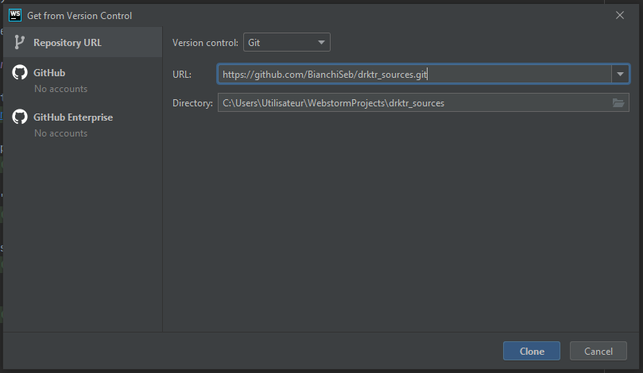
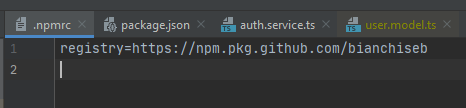
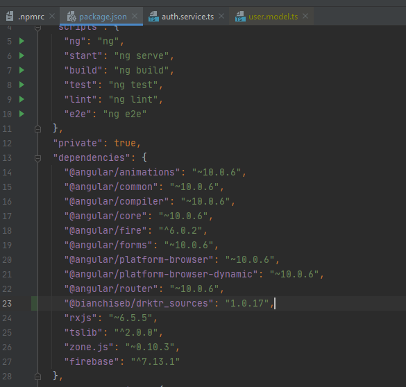

# Configurer un nexus sur un projet

* [Qu'est-ce qu'un Nexus ?](#quest-ce-quun-nexus-)
* [Générer un token](#générer-un-token)
* [Configurer le dossier source du projet (repo externe)](#configurer-le-dossier-source-du-projet-repo-externe)
* [Configurer le dossier du projet (repo interne avec Dependencies)](#configurer-le-dossier-du-projet-repo-interne-avec-dependencies)

## Qu'est-ce qu'un Nexus ?

Nexus est un manager de repository qui stocke des "artefacts".

L'utilisation principale d'un manager de repo est de créer un proxy et de mettre en cache des artefacts à 
partir de repo «externes». Votre entreprise utilise des bibliothèques open source et lorsque votre build en a 
besoin, elle interroge automatiquement un manager de repository local. Si ce manager de repository local ne 
possède pas cet artefact particulier, il le récupérera à partir d'un serveur de repo externe et le mettra en cache
pour une utilisation ultérieure. (Pensez au fonctionnement d'un système universitaire de prêt entre bibliothèques. 
Demandez à une bibliothécaire un livre rare. Si elle ne l'a pas, elle appellera probablement une autre bibliothèque et
se fera envoyer le livre.)

On peut avec ce process mettre à jour un fichier identique situé dans plusieurs emplacements d'un projet.

## Générer un token

1. Aller sur son compte github => cliquer sur settings

    

2. Ouvrir l'onglet Developer settings

    

3. Sélectionner l'onglet "Personal access tokens" et générer un nouveau token

    

4. Appeler son token nexus et sélectionner dans la liste repo, write packages, read packages, delete packages et gist

    
    
5. Générer le token (clic en bas de la liste)

    
    
6. Copier le token généré et le stocker dans Bloc-notes (ou autre traitement de texte) pour une utilisation future

## Configurer le dossier source du projet (repo externe)

1. Dans Github aller dans le projet projet_sources et cloner le repo (bouton CODE dans github)

    

2. Dans WebStorm => aller dans VCS => get from Version control => coller le lien du repo git

    

3. Ouvrir le terminal et coller `npm login --registry=https://npm.pkg.github.com/` et cliquer sur entrer

4. Dans name : écrire son nom d'utilisateur Github, dans password : coller le token précédemment enregistré dans Bloc-notes
(le password ne s'affiche pas appuyer quand même sur entrer), dans mail : entrer son adresse mail de son compte Github

5. Vérifier que la mise à jour d'un model s'exécute bien, ouvrir le dossier models, l'UserModel et ajouter une ligne

    

6. Faire un commit and push pour mettre à jour le repo Github

7. Dans le terminal entrer la commande `npm publish`

## Configurer le dossier du projet (repo interne avec Dependencies)

1. Dans github, copier le repo drktr et le cloner dans WebStorm (VCS => get from Version control => coller le lien du repo git)

2. L'ouvrir dans une nouvelle fenêtre (garder la fenêtre du repo source ouverte)

3. Aller dans le dossier frontend

4. Ouvrir le terminal coller `npm login --registry=https://npm.pkg.github.com/`

5. Se logger à nouveau (name = Github userName, Password = token généré, mail = gitHub mail)

6. Faire un clic droit sur le dossier frontend et créer un nouveau fichier nommé .npmrc

7. Dans ce même fichier y coller la ligne : `registry=https://npm.pkg.github.com/xxxxxxx` et appuyer sur entrer
    > Rappel : Il faut toujours laisser une ligne vide à la fin d'un fichier
    
    

8. Ouvrir le fichier package.json et coller dans Dependencies (après la dernière ligne contenant un @) : `"@xxxxxxx/projet_sources": "1.0.15",`

    

9. Vérifier que la version est bien la même sinon modifier la version (ex : 1.0.15 peut être 1.0.16), pour cela ouvrir le
fichier package.json du dossier source (projet_sources) et vérifier la cohérence entre les 2 versions

    

10. Mettre à jour la version du package.json du dossier local (projet), si besoin (en 1.0.17 ici)

11. Cliquer sur run npm install

12. Supprimer le fichier du UserModel (user.model.ts dans src => app => models)

13. Copier `'@xxxxxx/projet_sources": "1.0.17'` du fichier package.json et le coller partout où l'UserModel est utilisé
et importé, dans les imports après `import {USerModel} from` (Dans ce projet seul le fichier auth.service.ts utilise l'UserModel) :

    
