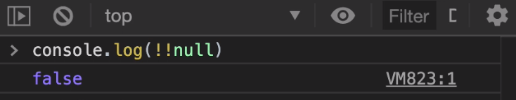

# truthy and falsy

* [Truthy](#truthy)
* [Falsy](#falsy)
* [Pour reconnaître un truthy ou un falsy](#pour-reconnaître-un-truthy-ou-un-falsy)

## Truthy

> Truthy est un boolean qui renvoie true

Dans une condition if, si la valeur est vraie (true), cela exécute le code de la condition : C'est un **truthy**

Par exemple :

```typescript
if (true) {
    console.log('ok');
}
```

Comme la condition est vraie, il s'affiche bien dans la console : ok

* Tant que quelque chose existe c'est un truthy (un nombre, un string, un array....)

## Falsy

> Falsy est un boolean qui renvoie false

Dans une condition if, si la valeur est fausse (false), cela n'exécute pas le code de la condition : C'est un **falsy**

Par exemple :

```typescript
if (false) {
    console.log('ok');
}
```

Comme la condition est fausse, il n'affiche donc rien dans la console

* Quels sont les falsy ?

On retrouve comme falsy :

1. false
2. null
3. undefined
4. NaN
5. 0 (tous les nombres sont des truthy à part 0)
6. '' (un string **vide** est un falsy)
7. !(L'inverse de tout ce qui existe) : **!1** ou **!true** est un falsy, 1 existe mais l'inverse n'existe pas

## Pour reconnaître un truthy ou un falsy

> Pour reconnaître un truthy ou un falsy il existe une astuce, il faut faire l'inverse de l'inverse de quelque chose,
> cela renvoie un boolean

Par exemple :

```typescript
if (!!true) {
    console.log('ok');
}
```

L'inverse de true est false et donc un falsy, rien ne s'affiche dans la console.

Mais l'inverse de l'inverse de true est donc l'inverse de false et cela renvoie un boolean et donc ok va s'afficher dans la console

Si l'on écrit :

```typescript
console.log(!!null);
```
Il s'affiche dans la console : 


